# Overview


> **Objectives**
> 
> After completing this lesson, you will be able to:
> 
> familiarize yourself with the concepts of an API layer.


# SAP Integration Suite - API Layer


## Script Overview
### Highlights
In this section, you will familiarize yourself with the concepts of an API layer which allows to centrally govern all enterprise APIs. By “govern” we mean to centrally secure, adapt, document, publish and analyse APIs centrally.

During this exercise, you will secure and publish an API. This API can then be used by any developer - internal or external - in a secure way, to build integrations or applications.

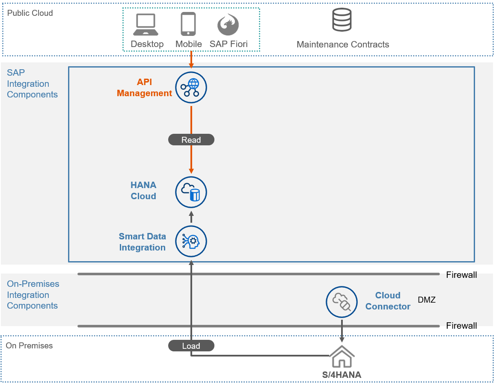
### Prerequisites
* Your Session-User, provided via mail or by your instructor
* Access to the landing page of your Session-Account via link, provided via mail or by your instructor
### Goal
The goal of this section is to configure SAP API Management to provide product information to developers. That API is originally available in a HANA Database.

### Further information
* [SAP HANA Cloud](https://help.sap.com/viewer/product/SAP_CLOUD_PLATFORM_API_MANAGEMENT/Cloud/en-US)
### Exercise map
In the following chapters of this exercise, you will create a so-called API proxy, add security and traffic management policies, and eventually publish this API on the API Business Hub Enterprise.

# Create the API


> **Objectives**
> 
> After completing this lesson, you will be able to:
> 
> manage the API that has previously been created in the in-memory SAP HANA database.

# API layer – Create the API
In this chapter you will manage an API for product data. This API can then be used by application developers to create various applications such as smartphone apps, kiosk applications, web pages, etc. This API can also be used by integration experts to configure process integration use cases.


## Access the API Management service
1. Click on the link for the SAP Integration Suite service
## Configure the API Provider
SAP API Management is part of the SAP Integration Suite and is based on reusable artefacts to ease the overall developer experience and increase efficiency. Hence, we will start by creating an API Provider that will point at the OData API that we have defined previously.

> **Note**: You can access the shared OData API through the following URL:
> 
> * https://prod-intta-content-v3.cfapps.eu10-004.hana.ondemand.com/odata/v4/data/products

In this exercise, we will configure the hostname and protocol (HTTPS) for connecting to your selected API. For the shared OData API, the hostname is **prod-intta-content-v3.cfapps.eu10-004.hana.ondemand.com**.

1. Navigate to the **Configure** section of the SAP Integration Suite using the left-hand menu and click on APIs.

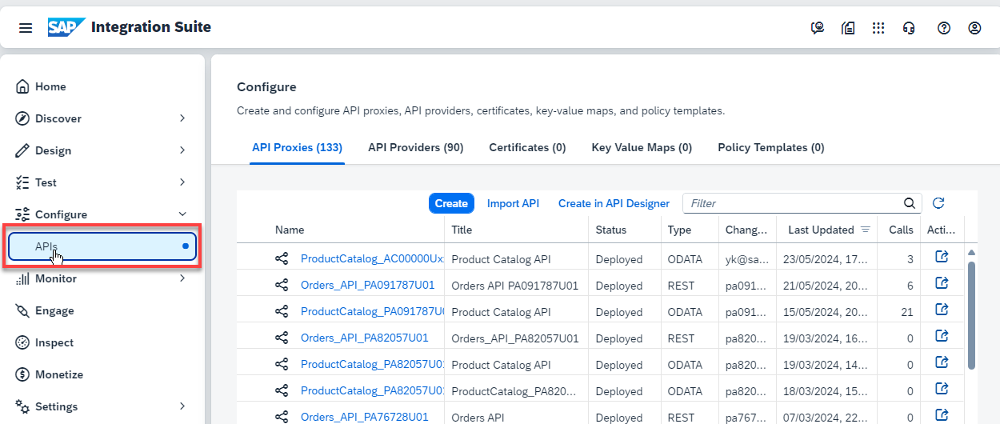

2. Select the **API Providers** tab in the main section.

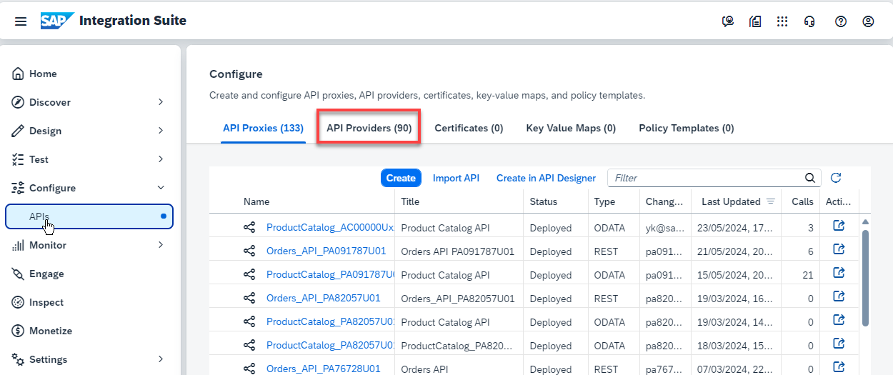

3. Click on the **Create** button of the **API Provider** section.
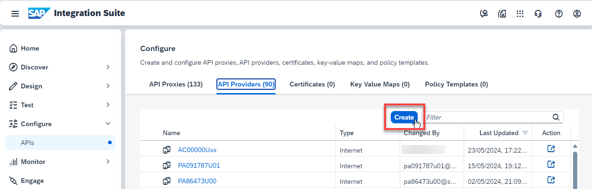
4. Enter the **Overview** information as follows:
    1. **Name**: *AC233083U01*
    2. **Description**: *This provider represents the HANA database that provides the "products" REST API.*
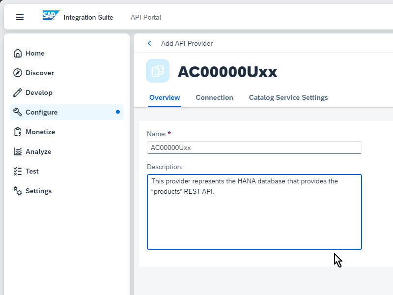

1. Click on the Connection tab and enter the information as follows:
    1. **Type**: Internet
    1. **Host**: prod-intta-content-v3.cfapps.eu10-004.hana.ondemand.com
    1. **Port**: 443
    1. **Use SSL**: checked
    
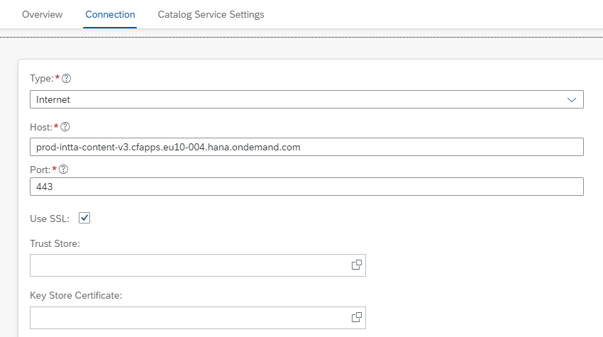

6. At the top right corner, click on **Save**.

## Configure the API Proxy
Now that we have configured an API provider, which includes a hostname and port where the API is accessible, we will create an **API proxy**. An API proxy follows the facade pattern, hiding the actual backend API and providing an abstraction layer for configuring its usage (such as security, traffic management, and analytics). To consumers, the API proxy appears as a standard API.

The shared OData API is accessible via the following URL:

* https://prod-intta-content-v3.cfapps.eu10-004.hana.ondemand.com/odata/v4/data/products
In this exercise, we will configure the API Proxy to “point” to the “/odata/v4/data” resource for the OData API.

1. Click on the **API Proxies** tab.
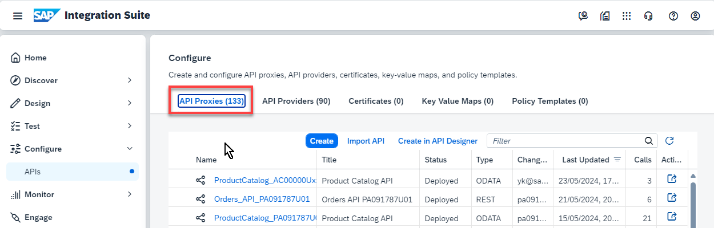

      Alternatively, navigate back to the Configure section the left-hand side menu and click on **APIs** again.

1. Click on the **Create** button of the **API Proxies** section.
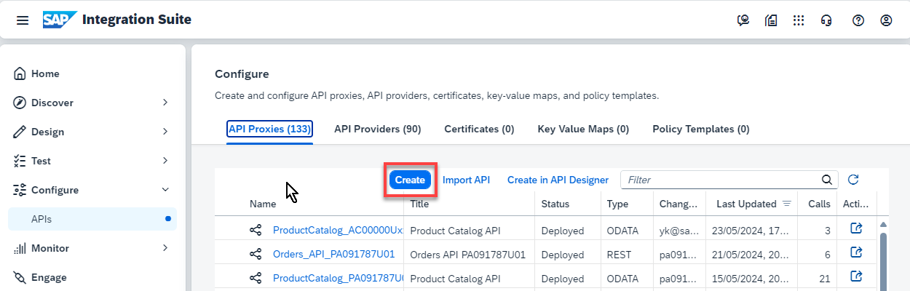
1. Enter the information as follows:
    1. Select **API Provider**: AC233083U01
    1. **URL**: /odata/v4/data
    1. **Name**: ProductCatalog_AC233083U01
    1. **Title**: Product Catalog API
    1. **API State**: Alpha
    1. **Host Alias**: leave as-is
    1. **API Base Path**: /ProductCatalog/AC233083U01
    1. **Version**: v1 (note that this will impact Name and API Base Path fields)
    1. Select **Service Type**: ODATA
    1. **Documentation**: Yes
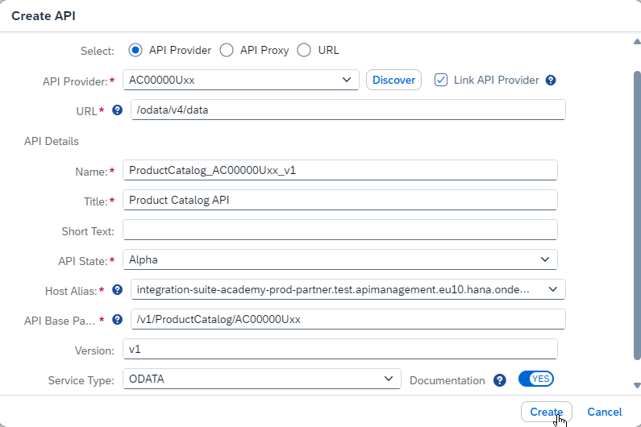
1. Click on **Create**
You have configured several things above.

    * First, you defined the API proxy will “point” to the **HANACloud** API provider, i.e. its hostname and port. Also, you have defined that you want to proxy the **data** resource.
    * After that, you have defined an internal name and a title for the API proxy.
    * Then, you have defined the lifecycle **state** of the API, which is alpha because it is under development.
    * The **Host Alias** field defines the host name on which this API will be available to the end-consumers of the API, e.g. developers or integration experts.
         > **Note**: you can have multiple choices, as configured for your company (e.g. “apis.mycompany.com”).

    * To manage the lifecycle of the API, you have defined a **version**, which has been automatically reflected in other fields - visible by the API end-consumer. For instance: in case the API is changed in a non-retro compatible way (data structure change), we would introduce a new version of the API.
    * Lastly, because the backend API is in the **OData** format, we will profit from the metadata natively available over the **$metadata** resource. This will allow SAP API Management to automatically create all the necessary documentation when the API proxy is being generated.
1. Click on the **Overview** tab and enter a meaningful **description** such as: *This API provides a catalog of all our products, services and more.*
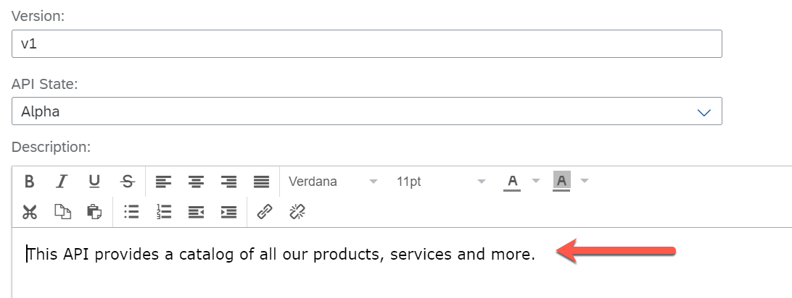
1. Click on **Resources** and look at the documentation that was automatically generated using the OData metadata information.
    > **Note**: the documentation can also be adapted and enhanced to fit your needs. To do so, use the pencil icon for each resource.
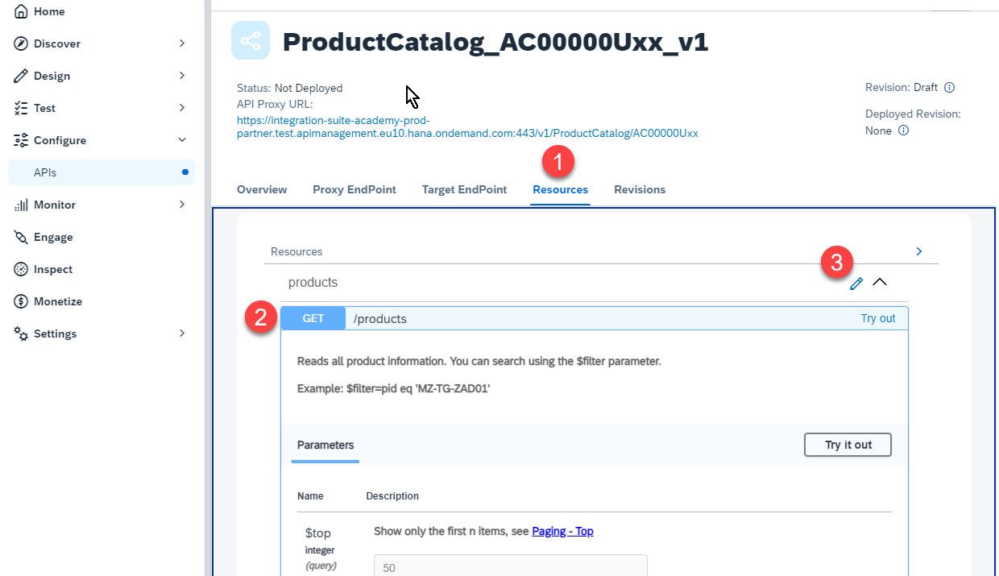

Make some additions for the GET operation. For instance:


> Reads all product information.
> You can search using the $filter parameter.
> 
> **Example**: $filter=pid eq 'MZ-TG-ZAD01'

Click on **OK**.

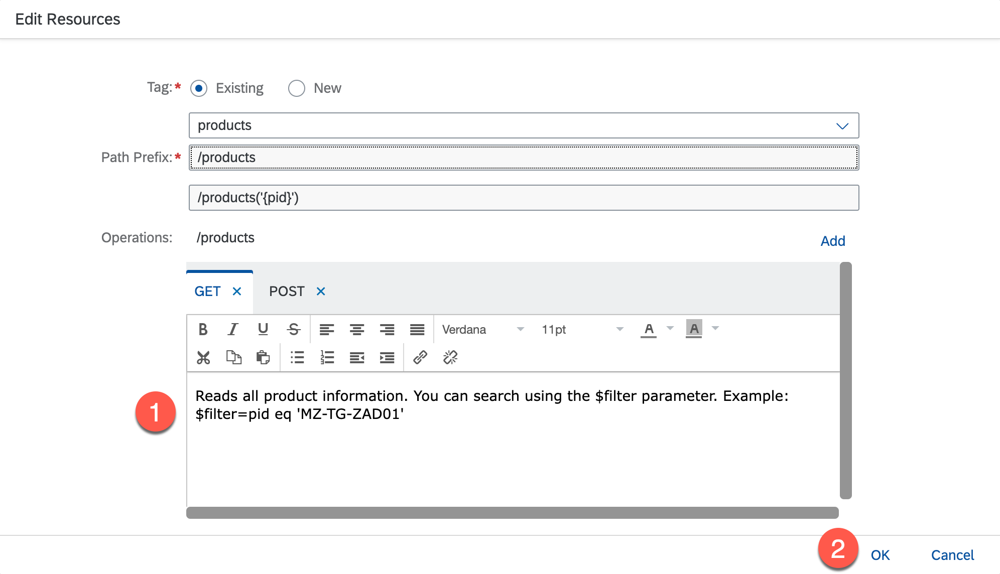

1. Note the changes in the documentation by clicking on **GET**.

1. Now click on **Save** to persist all your changes.

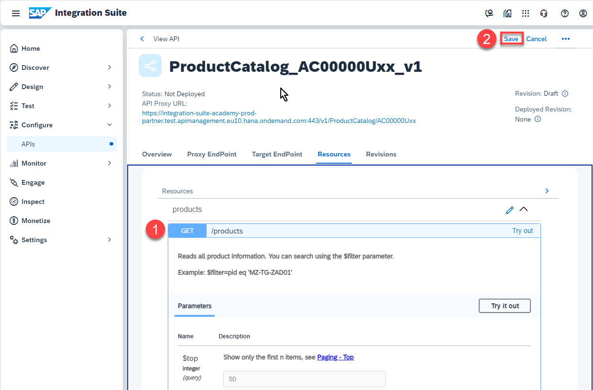

## Test your API (Proxy)
Let’s now test the API proxy you have just created.

1. On the top-right corner, click on **Deploy**. If you cannot see this menu item, click on the three dots … to extend the menu and select **Deploy** from there.

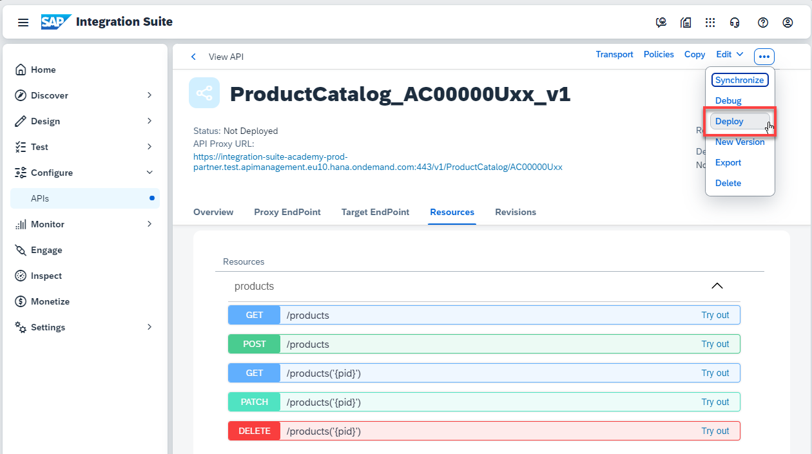
    > **Note**: If an error “API failed to deploy” appears, please refresh your browser and repeat step 1 above.

1. Once your API Proxy has been deployed, it can be accessed through the URL we have defined before. Click on the URL that is being displayed and check that the API is available through API Management.

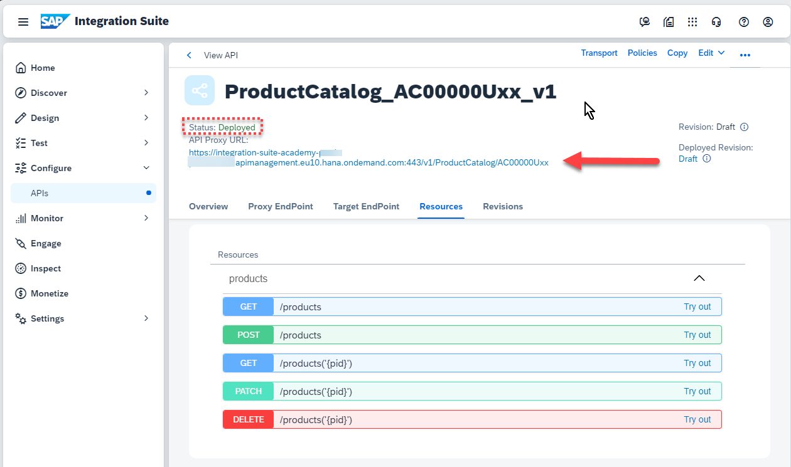
    This opens a new browser tab with the URL of your API Proxy. At the end of the URL, type /products and hit enter.

All products are now displayed:
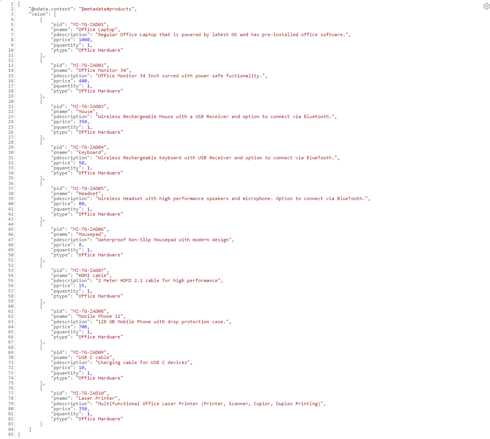

Thanks to OData, you can use standard features to select, search and filter the API content - without any additional coding in the backend implementation.

For instance, you can search for products based on their description. To test this, add the following string at the end of your URL and hit enter:

*?$filter=contains(pdescription,'Monitor')*
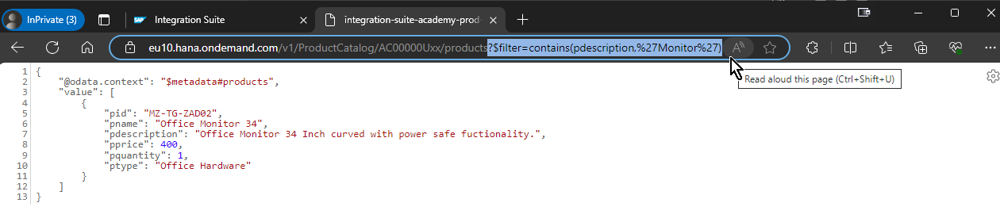

You can also display just one product, identified by its ID, without any additional coding in the API implementation.

To test this, replace the previous filter with the following string (at the end of your URL) and hit enter:

*('MZ-TG-ZAD01')*

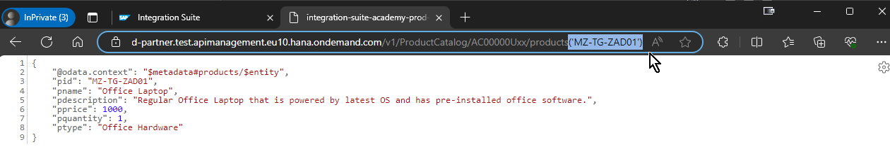
Congratulations! You are now ready for the next lesson!

# Configure the API proxy


> **Objectives**
> 
> After completing this lesson, you will be able to:
> 
> configure the API proxy by adding security and traffic management features.
# API layer – Configure the API proxy
In this chapter you will configure policies to the API proxy that you have created in the previous chapter. You will add a security and traffic management feature to make sure both your API and your backend system are secured from rogue access or traffic loads.

## Configure traffic management
Now that your HANA API is available through SAP API Management, we will ensure that the backend system will not be brought down by heavy traffic or by denial-of-service attacks. To do so, we will use predefined traffic management policies available in the policy editor.

1. Open the API Proxy you previously created and click on **Policies** at the top right side of the screen. This will open the **Policy Editor** in which you will define the behavior of the API proxy when it is called by the consumer.
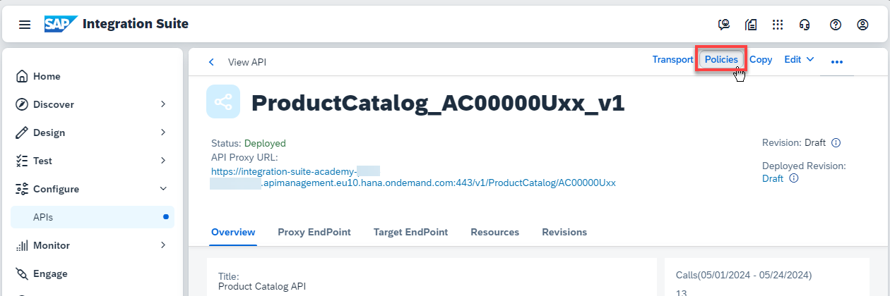
    You can position policies in different places in your pipeline (Proxy Endpoint, PreFlow, PostFlow, …). This will affect when a policy is being invoked: before entering the policy pipeline, before hitting the endpoint, etc… More information about the flows are available [online](https://help.sap.com/viewer/66d066d903c2473f81ec33acfe2ccdb4/Cloud/en-US/08b40d9e47a0470a8b14cc47abab89ec.html).

    In our case, we want the policies to be invoked at the very beginning of the pipeline, i.e. when the proxy endpoint is hit and before the conditional flows are hit.

1. In the Policy Editor, click on **Proxy Endpoint**, then **PreFlow** and lastly on **Edit**.
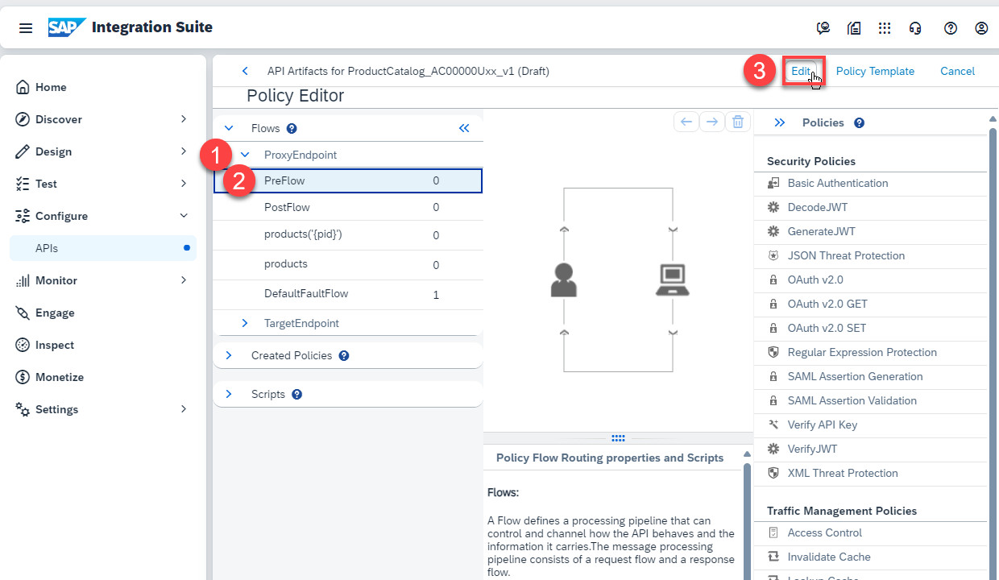
1. On the right side menu, you can see all the predefined policies. Locate the **SpikeArrest** policy and click on the + symbol next to it.
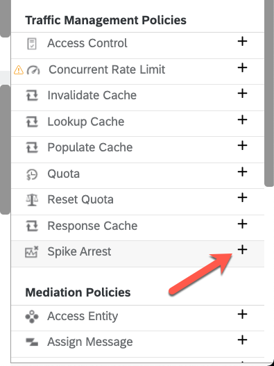
1. Enter **SpikeArrest** as Policy Name and click **Add**.
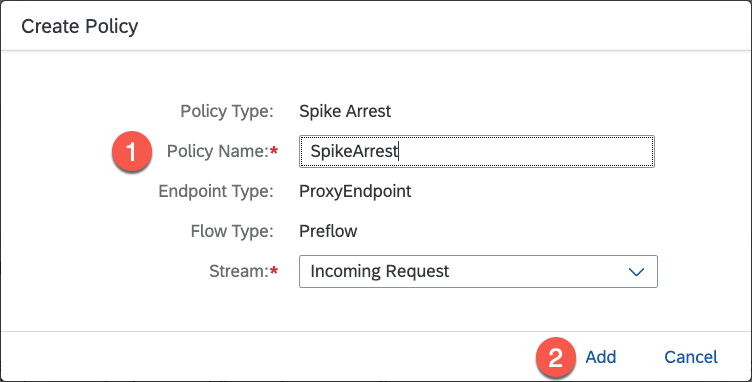
In your policy editor, you can now see the new policy and change its configuration in the lower panel.

1. Change the XML configuration from 30pm to 5pm. This simply changes the amount of request from 30 to 5 per minute.
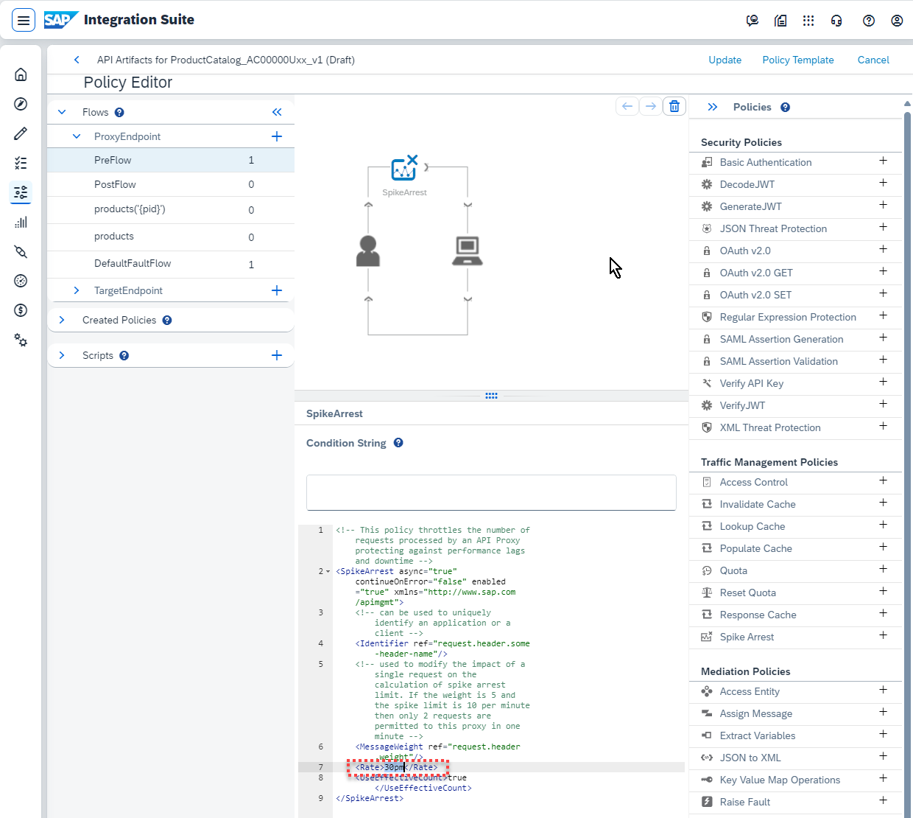
1. Click on **Update** in the Policy Editor.
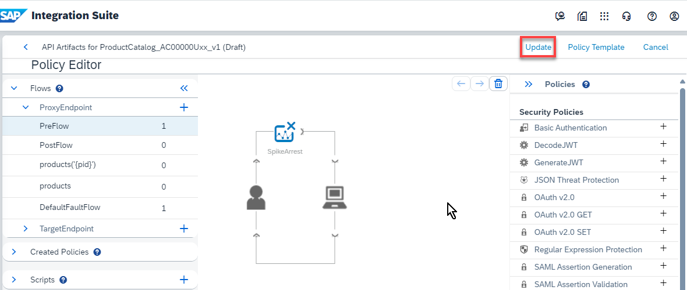
1. **Save** your API Proxy.
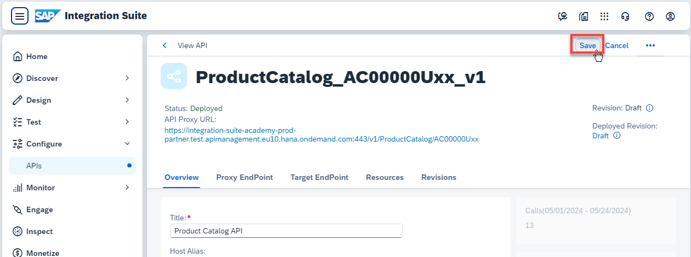
1. **Deploy** your API Proxy.
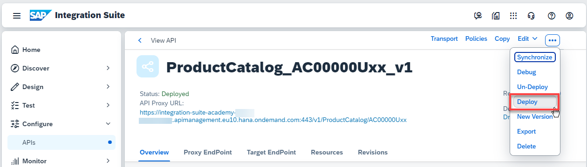
The [spike arrest policy](https://help.sap.com/viewer/66d066d903c2473f81ec33acfe2ccdb4/Cloud/en-US/bf441dc839034613b059cb508ad610f7.html) policy is implemented as a rate limit which is based on the time the last matching message was processed. If you specify 5 messages per minute, it means that only 5 requests can be submitted in a minute, a 6th request within 60 seconds on the same API Management server will be rejected.

1. Test your policy by using the link of the API Proxy, as you did previously. If you make several calls in short intervals, you should run into the spike arrest limitation.
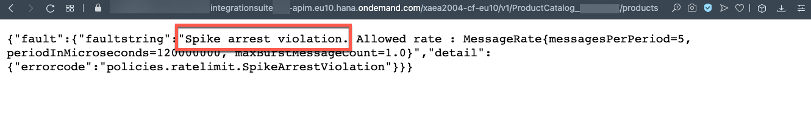
> **Note**: you can disable the policy by configuring its enablement to “false” if you don’t want the policy to be active for the next steps.

`<SpikeArrest async="true" continueOnError="false" enabled="false" xmlns="http://www.sap.com/apimgmt">`
## Configure security
As you have noticed, the API from your backend system is fully accessible without any restrictions. In productive scenario, the backend should be protected by typical authentication mechanisms like basic authentication, SAML, OAuth, JWT, … API Management can be used as “security mediation” layer, in which any kind of credential is checked and then passed to the backend in the desired format using predefined policies. In our scenario, we will keep things simple: you will add an API key verification, which will make sure the consumer is allowed to access the API. Note that is not sufficient to properly secure your API since API keys can be read from applications (retroengineering) or network sniffers (it is not required to use SSL for an API key - in contrary to OAuth for example).

1. Go back to your policy editor and click on **Edit** to make the changes.
1. Click on **ProxyEndpoint** and **PreFlow** in the “Flows” panel on the left.
1. Locate the **Verify API key** policy on the right and click the + button.
1. Enter **VerifyAPIkey** as Policy Name and click **Add**.
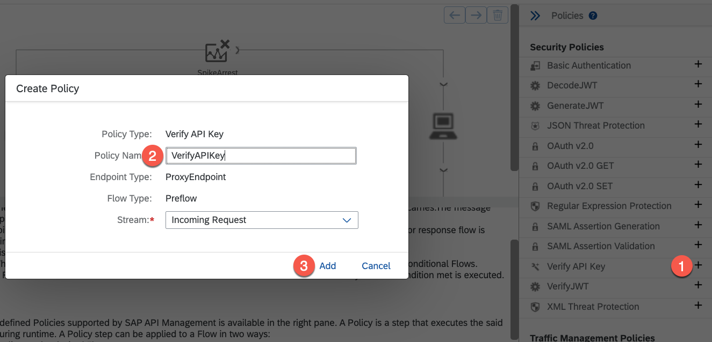
In the configuration pane under the policy, we will now define where the API key comes from.

1. Replace the value of the **ref** property of the **APIKey** tag with the following value: `request.queryparam.apikey`
This tells the proxy to look for the api key in the HTTP request parameter called “apikey”.
Here is the complete XML configuration of the policy in case you need it:

```
<VerifyAPIKey async='true' continueOnError='false' enabled='true' xmlns='http://www.sap.com/apimgmt'>
   <APIKey ref='request.queryparam.apikey'/>
</VerifyAPIKey>
```


6. Click on **Update** in the policy editor, then on **Save** in the API proxy and finally on **Deploy**.

1. Test your policy by using the link of the API Proxy, as you did previously. API Management now throws an error telling you that no parameter with the name “api key” has been found.

    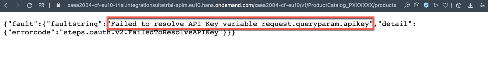

1. At the end of the URL of your API, add the following text: ?apikey=12345. This adds the apikey parameter with a dummy value to the request. Now execute your request again.
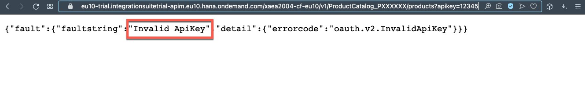

As you can see, the error message is now different: API Management has found the apikey, but its verification failed. This is normal: the API key has not yet been generated. This is what you will do in the next chapter.

Congratulations! You are now ready for the next lesson!

# Publish the API proxy


> **Objectives**
> 
> After completing this lesson, you will be able to:
> 
> publish the API so it can easily be discovered, tested, and used.
# API layer – Publish the API proxy
In this chapter you will publish the API you have created previously so it can easily be discovered, tested, and used by anyone.

## Create an API product
In API Management, you can reuse artifacts. The same applies to API proxies: API proxies can be bundled in different **API products** to be published in different ways to developers (as freemium API, paid API, internal-only, …). This is what you will do next: create an **API Product** which will include your previously created **API Proxy**.

1. Navigate to the **Engage** section of the SAP Integration Suite using the left-hand menu.

    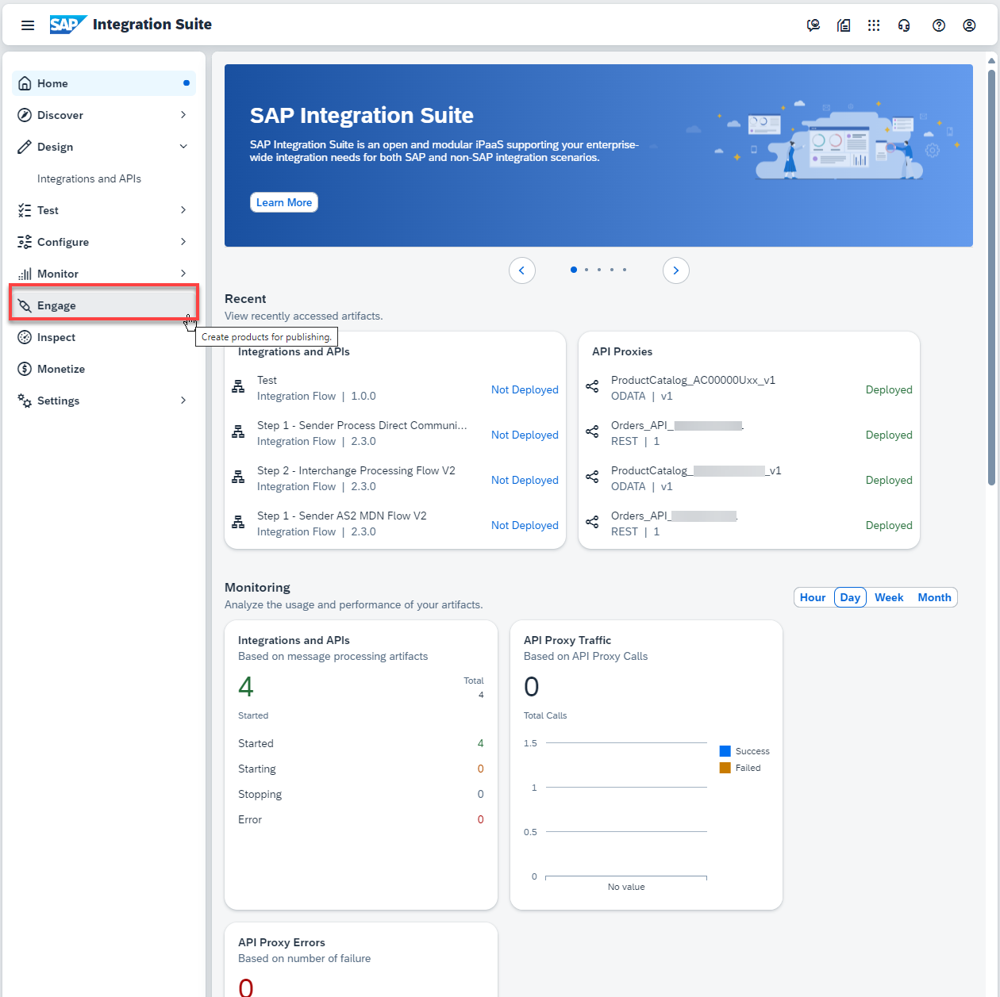

1. You will see Products and Applications. Click on **Create**.

    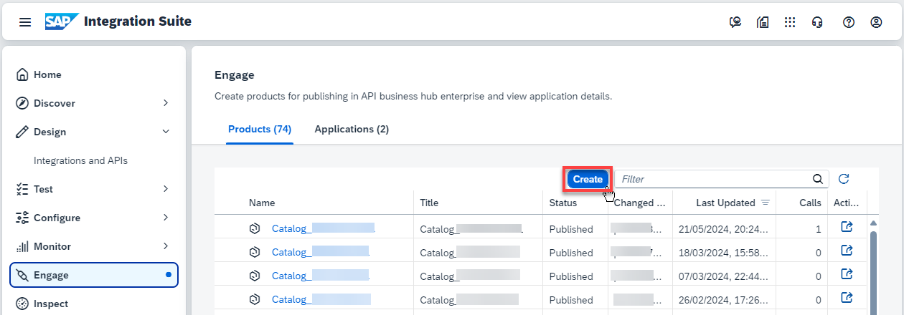
1. Enter the following information:

    1. **Name**: Catalog_AC233083U01
    1. **Title**: Product Catalog AC233083U01
    1. **Description**: Access our product APIs to get more information or to place an order.

    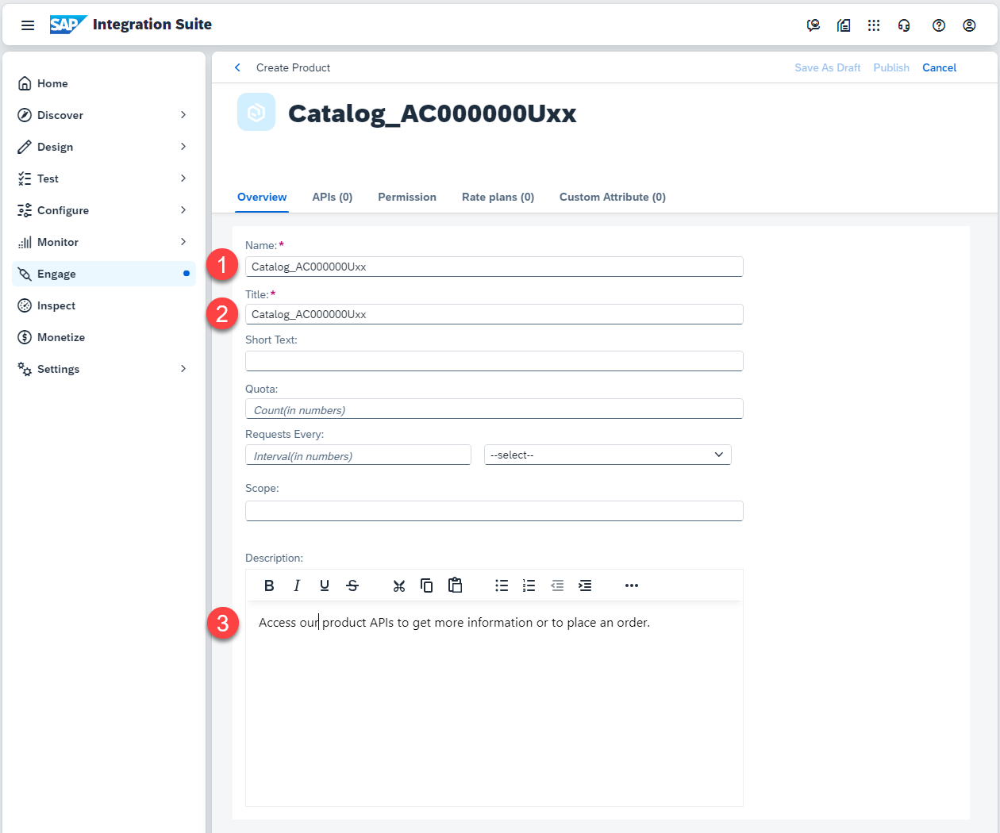
1. Click on the **APIs** tab.

1. On the right, over the table , click on **Add**.

    
1. Search for your API proxy (ProductCatalog_AC233083U01) and select it to add it to the API Product.

1. Click on **OK**.

    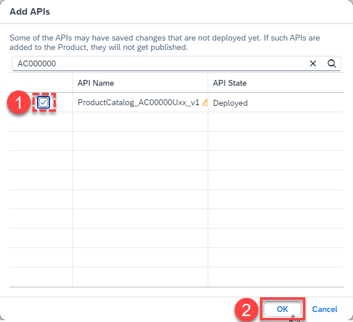
Note that could also limit the API proxy on specific resources in order to include only a subset of information in one API product, and include more information in another API product - but using the same API proxy.

1. Click on **Publish** in the top right corner menu.

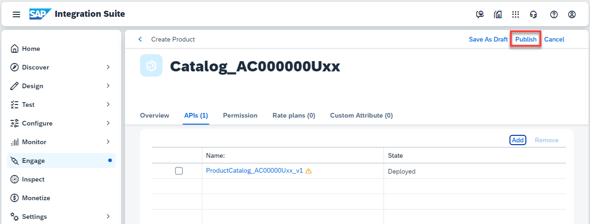
The API product is published on the Developer Hub, to be discovered, tested, and used by developers, integration experts, partners and so on.

## Create an API key
You will now act as consumer of the API proxy we have created and published.

1. Open the **Developer Hub** by clicking on the link on the top right menu.

    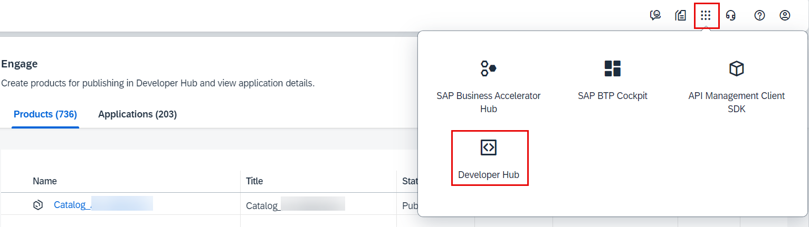
1. You can search for your user **AC233083U01** to see, that you now have access to the product **Catalog_AC233083U01**.

Click on it.

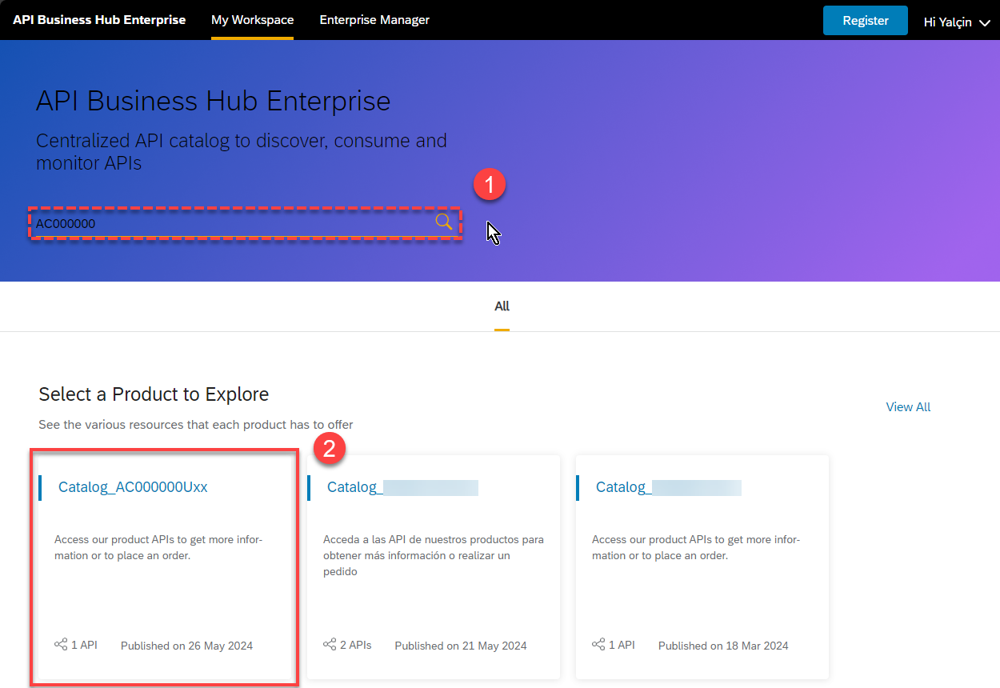

3. Click on the **APIs** tab to view the APIs contained in this API product.

    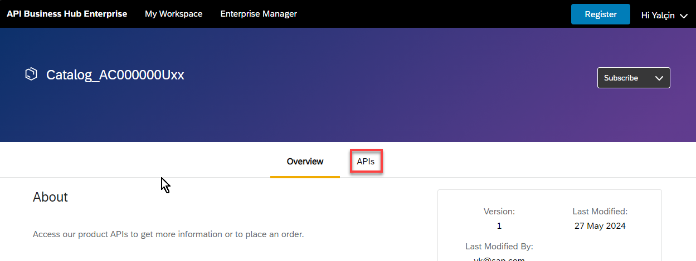

1. Click on **Product Catalog API**.

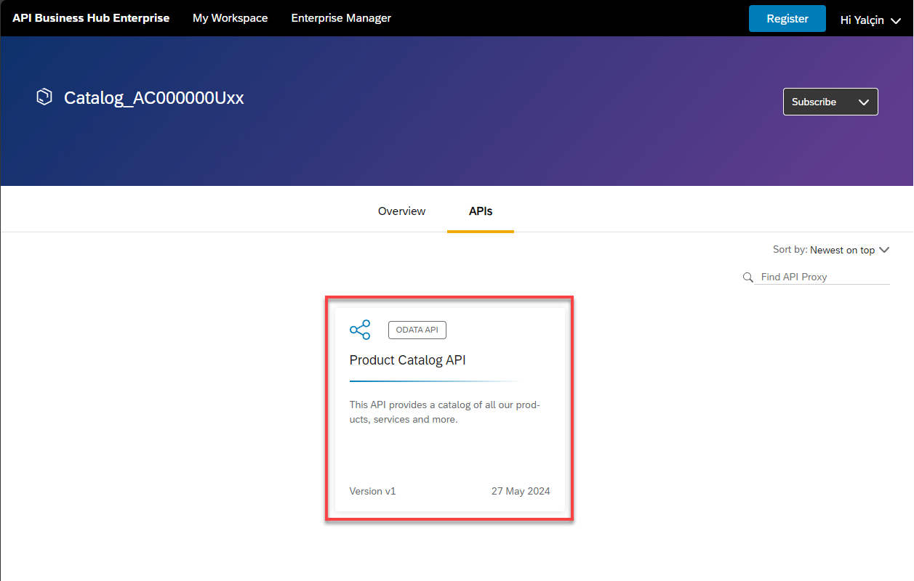
    
> **Note**: you can now browse through all the resources of the API, see the documentation, try it out, get code snippets and so on. Also, the documentation that we added previously is available here.


5. Click on **API Reference**

    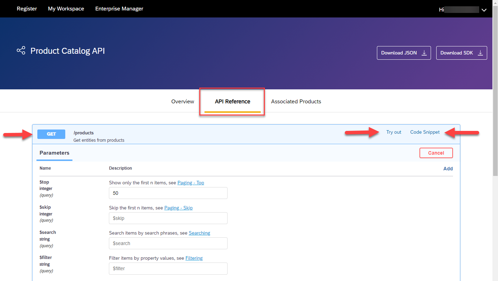
As a developer or integration expert, you may want to use this API in your project. This means that you will get an API key from the Developer Hub which your application will provide everytime the API is called. This not only allows to do a first authorization check, it also allows API management to know exactly who has used what API in the what application context.

1. In your browser, navigate one step back - or alternatively, navigate to the **Catalog** API product.

1. Click on the **Subscribe** button and select **Create new application**.

    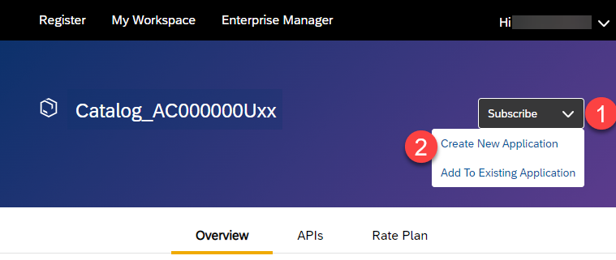
> **Note**: If you see the following error “**You can only create application on behalf of developers**” you will need to register your user with Developer Hub.
    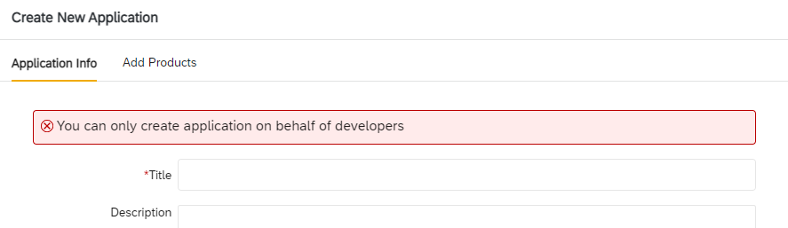

> 1. Click Cancel on the open dialog box
> 1. Click Register on the top right of the screen
> 1. Click the Register here button then OK
> 1. Logout and Login and now you should be able to repeat steps 6 and 7 below with no error.

8. Enter the details as follows:

    1. **Title**: Sales App AC233083U01
    1. **Description**: This application is the Sales App we are developing for providing real-time product information to our sales colleagues on their tablets.
    1. **Take me to this application now**: checked
1. Click on **Create**.

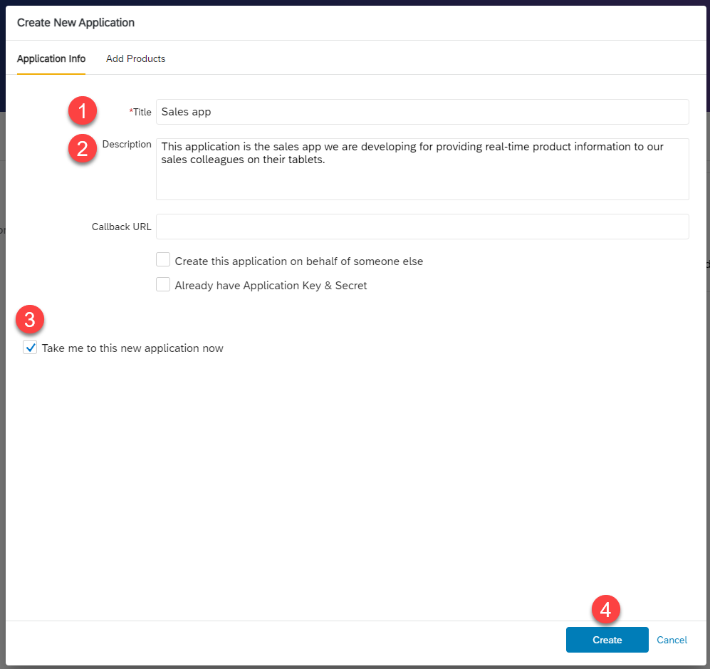
As you can see, you have now access to an **Application key**, also known as **API key** or **Application secret**. You can now use this key to access the REST API we have previously configured, which is “secured” by an API key.

   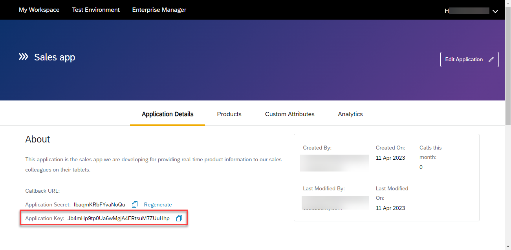
    
10. Copy the value of the **Application key** from the user interface.

1. In a Browser, open the **API proxy** url you created in the last chapter (you can go to the “Details” section of the **API** in the API Business Hub) and append the **apikey** parameter to the request. Example:

```
{your API Management URL}?apikey=Jb4mHp9tp0Ua6wMgjA4ERtsuM7ZUuHhp
```
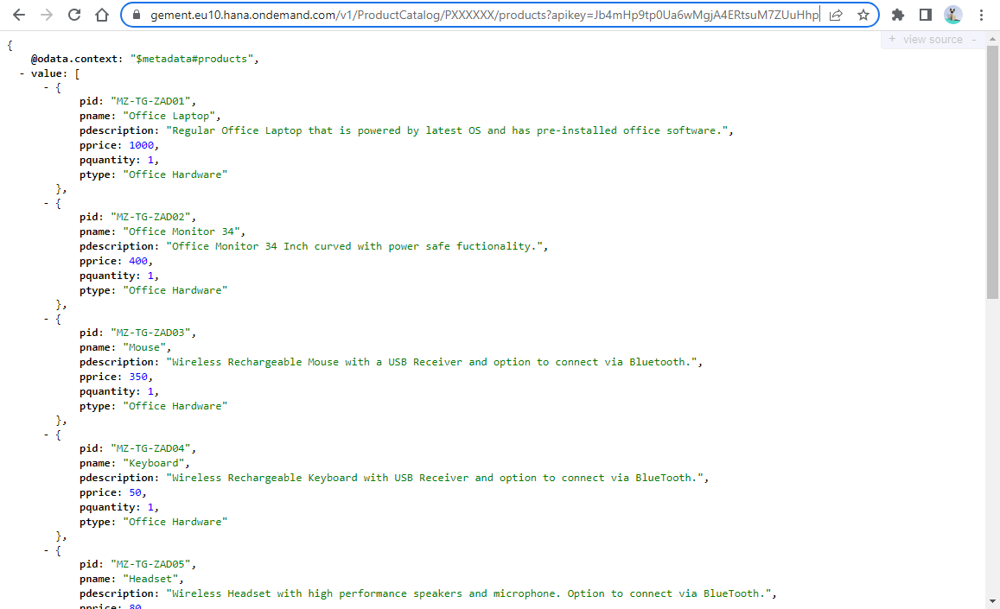
You not only secured your API call (at least a little), but the API key value is also interpreted by SAP API Management for analytical purposes. Hence, you can see exactly what application, developed by what user, is making what API Calls.

Congratulations! You have successfully abstracted, secured, published and consumed an API! Let’s move to the next unit where you will create an integration flow for processing incoming orders.