# Overview


> **Objectives**
> 
> After completing this lesson, you will be able to:
> 
> familiarize yourself with the concepts of Process Integration
# SAP Integration Suite - Process Integration
## Script Overview
#### Highlights
In this section, you will familiarize yourself with the concepts of process integration, and especially with the Application Integration (A2A) pattern.

During the course of this exercise, you will create an integration process, exposed as OData Rest API, that will sychronize data in 2 different systems: the ERP system (order) and the maintenance contracts database.

After that, you will secure and expose the interface of the integration process to be consumed by any channel.

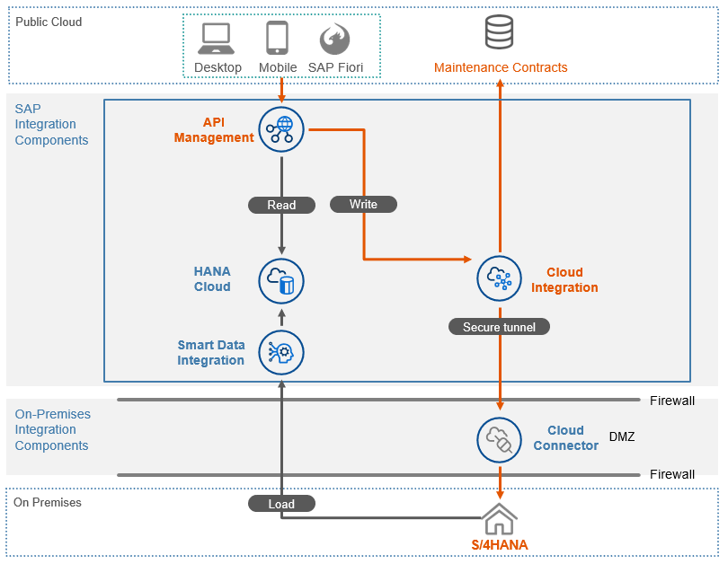
#### Prerequisites
* Your Session-User, provided via mail or by your instructor
* Access to the landing page of your Session-Account via link, provided via mail or by your instructor
* You have downloaded the following files onto your local device:
    * [OpenAPISpec.json](https://da4ug0lohul1.cloudfront.net/prod/AcademyContentFileImage/TA_Integration-Suite/223_TA_BTP-INT_Process-Integration/Files/OpenAPISpec.json)
* You have installed Postman or you have another tool that let’s you easily test web services such as REST APIs.
#### Goal
The goal of this section is to configure SAP Cloud Integration to write a sales order coming from any channel to S/4 HANA and a cloud provider (e.g. AWS, Azure, GCP) SQL database dynamically.

#### Further information
* [SAP Integration Suite overview](https://www.sap.com/products/technology-platform/integration-suite.html)
* [SAP Cloud Integration documentation](https://help.sap.com/viewer/368c481cd6954bdfa5d0435479fd4eaf/Cloud/en-US/2fb0aa4dc5194b589adcd1c5534901e3.html)
#### Exercise map
In the following chapters of this exercise you will create an integration flow accesible over a REST API, and write the incoming data to both S/4 and an Azure PostgreSQL DB.

# Create the integration flow


> **Objectives**
> 
> After completing this lesson, you will be able to:
> 
> create an integration package and an integration flow, to be exposed as REST API.
# Process Integration – Create the integration flow
In this chapter you will create an integration package (a logical bundle of integration artifacts) and an integration flow (the actual implementation of an integration use case). This integration flow will be exposed as REST API to be used by any developer or integration expert. This integration flow will process the incoming orders to send them dynamically into different backend systems (S/4HANA and PostgreSQL database).


## Useful Information about the CPI Helper browser plug-in
The ConVista CPI Helper is an open source Chrome Browser plug-in that extends the SAP Cloud Platform Integration to enhance its usability. Visit this [blog](https://blogs.sap.com/2021/03/12/cpi-convista-cpi-helper-the-show-goes-on/) to learn how to setup CPI helper for your Chrome or Edge browser.

## Access the Cloud Integration service
1. Access the [SAP Integration Suite](https://integration-suite-academy-us10.integrationsuite.cfapps.us10-002.hana.ondemand.com/shell/home) service and navigate to the Design section in the left-hand menu.

    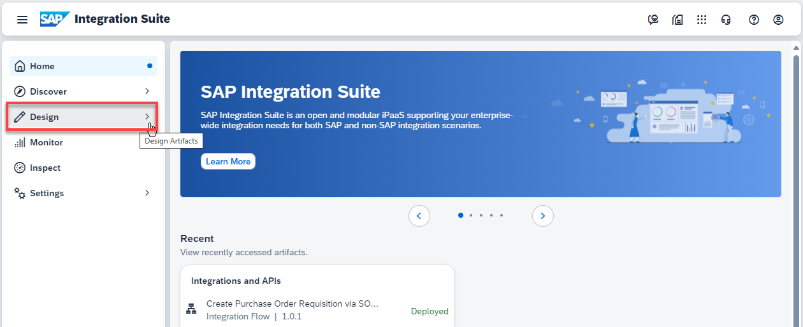
1. In the left-hand menu of the SAP Integration Suite below **Design** click on **Integration and APIs**.

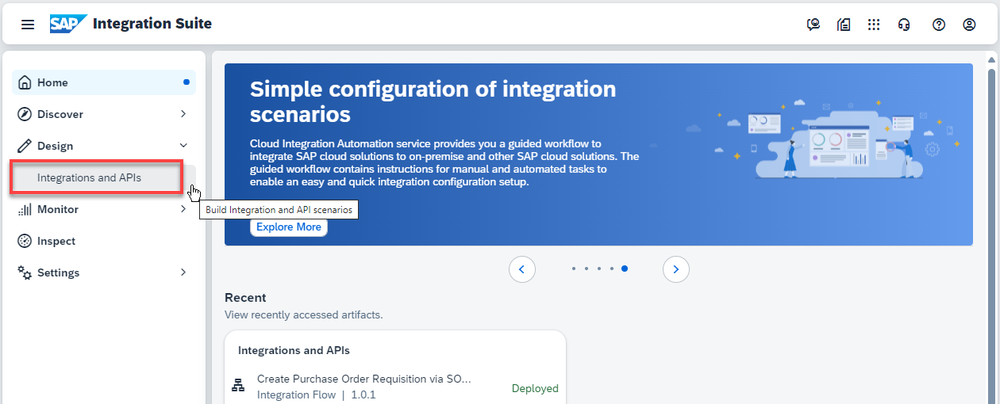
## Create the integration package and integration flow
When you log into Cloud Integration, you can discover and download predefined integration packages. These packages contain artifacts like integration flows that implement specific use cases. This content is delivered and supported by SAP (or partners) and can be used to quickly implement specific integration projects. Feel free to browse for existing integration packages. However, in this exercise, we will create an integration package and integration flow from scratch.

In the **“Design”** part (**Pencil icon**) on the left side menu of the SAP Integration Suite UI, you can configure and edit the predefined integration content, or create your own.

1. Click on **Create** to create an integration package.

    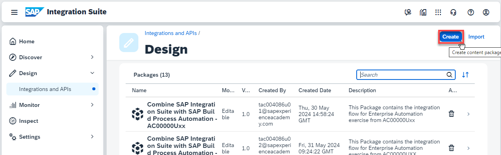

1. Provide the following details:

    * **Name**: Orders_USERXX
    * **Technical Name** will be auto-filled with OrdersUSERXX
    * **Short description**: This package contains artifacts to process orders.

1. Click on **Save** once finished.

    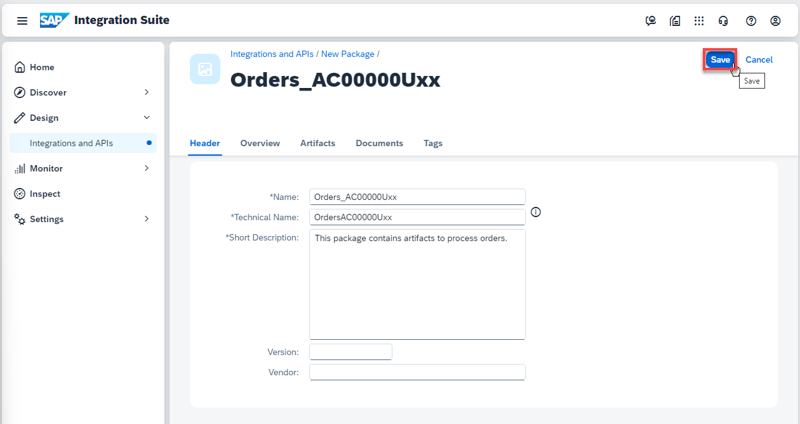
Within an integration package, you can add several artifacts: REST APIs, OData APIs, integration flows, mappings, and more. In our case, we will create an integration flow.

1. In the Cloud Integration service, within your package, make sure that you are in **Edit** mode (**Save** is displayed instead of **Edit**) of the package.

1. Click on the **Artifacts** tab and click on **Add** to select **Integration Flow**.

    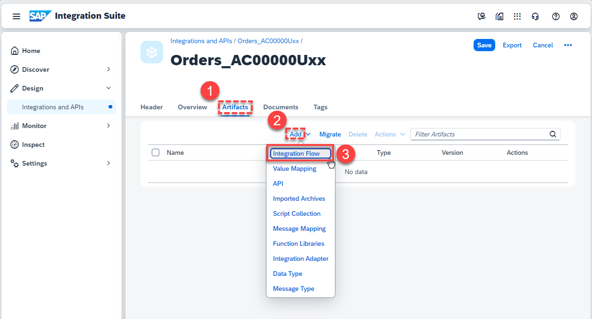
1. Complete the fields as follows:

    * **Name**: ProcessOrder_AC233083U01 
    * **ID** will be auto-filled with ProcessOrder_AC233083U01
    * **Description**: This integration flow will process incoming orders. 
    * The fields **Sender** and **Receiver** are not relevant for now. 
    * Click on **Add and Open in Editor**
    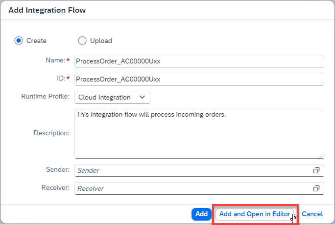


Your first integration flow has correctly been created.

## Configure the integration flow
You can see that the Cloud Integration service has prebuilt parts of the integration flow, including Sender, Receiver, Start and End flow steps.

1. Click on the Edit button to start making changes to your integration flow.

    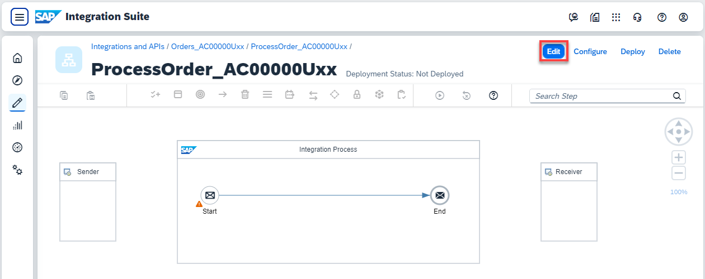
We will now edit the integration flow so it can receive data over an adapter of our choice, in our case the **HTTP** adapter.

1. Click on the **Sender** box.

    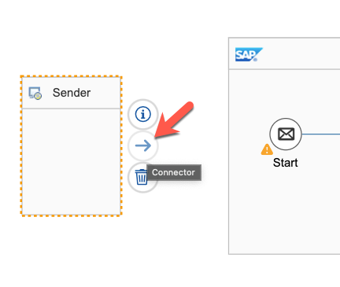
1. Click and drag the arrow symbol to the **Start** flow step.

    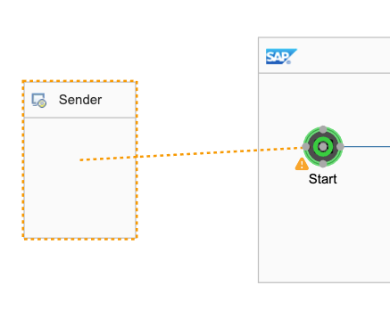
1. In the pop-up for the Adapter Type, chose **HTTPS**.

    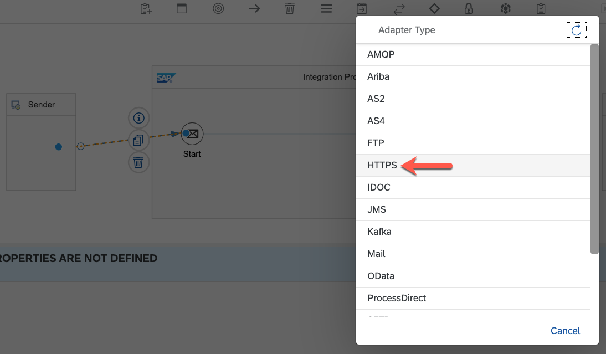
In the integration flow editor, you can now configure the adapter.

1. Open the configuration of the adapter with any of the controls at the bottom of the editor (Restore is a good idea).

    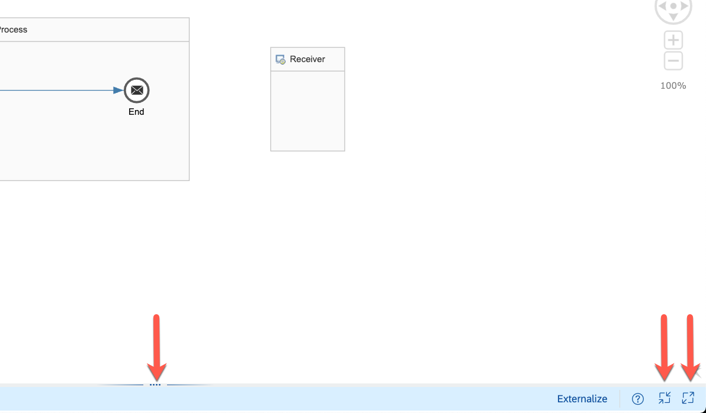
1. Click on the **Connection** tab. You will now define **how** this integration flow will be called. Specifically, you will define the URL of the REST API and the authorization configuration. In this case, the integration flow will be available over the “Orders” Resource and only if the consumer has the “ESBMessaging.send” role.

1. Define the Connection as follows:

    * **Address**: /Orders_AC233083U01
    * **Authorization**: User Role (default)
    * **User Role**: ESBMessaging.send (default)
    * **CSRF Protected**: unchecked
1. Click on **Save** to persist your changes.

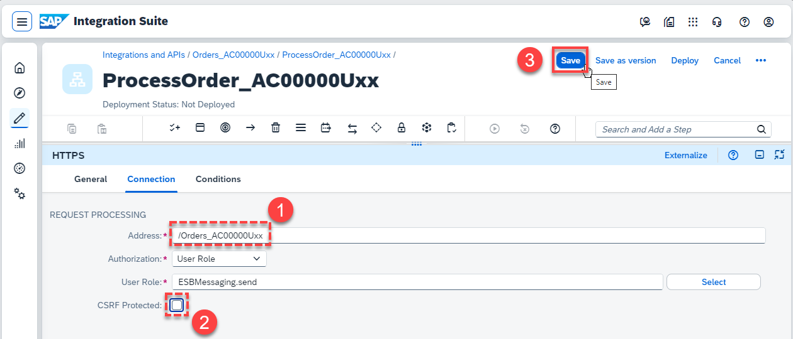
Congratulations! You are now ready for the next lesson!


# Configure the integration flow


> **Objectives**
> 
> After completing this lesson, you will be able to:
> 
> refine the integration flow so that it writes the data in a PostgreSQL database.
# Process Integration – Configure the integration flow
In the previous chapter you created an integration package and an integration flow that can be called using a REST API. In this chapter, you will refine the integration flow so that it writes the data in a PostgreSQL database. Hence, once an order is created from any system using the integration flow REST API, a maintenance contract will be written into the maintenance contract database.

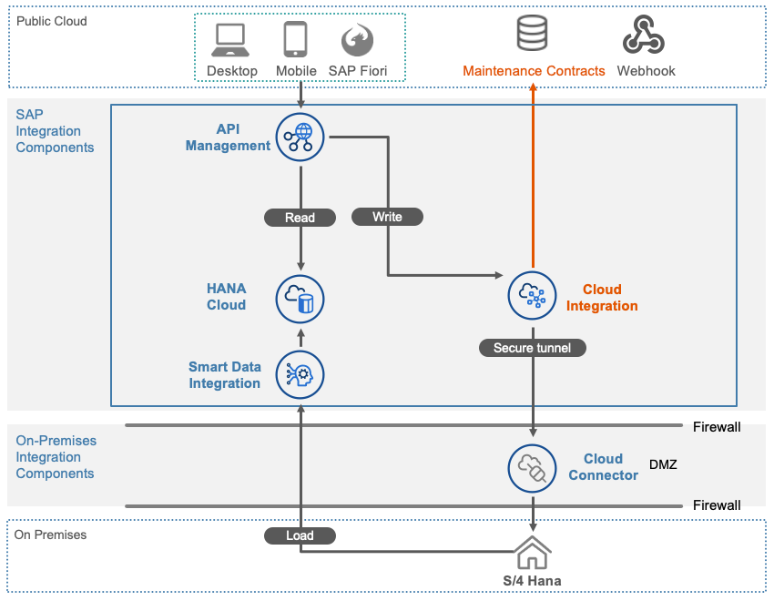
## Access the Cloud Integration service
Make sure you are inside the SAP Integration Suite - **Integration and APIs** section, otherwise access the [SAP Integration Suite](https://integration-suite-academy-us10.integrationsuite.cfapps.us10-002.hana.ondemand.com/shell/home) and navigate to the Design section in the left-hand menu.


Enhance integration flow to write to PostgreSQL
We will now proceed to create the request for writing the data into the maintenance database. To do so, we will create a SQL-statement using the incoming payload. This will include 2 steps: transforming the incoming JSON data structure into XML and building the SQL statement for the database.

Note that the incoming payload looks like this:

```
{
  "CustomerName": "HighTech Sports Inc.",
  "CustomerID": "17100004",
  "ProductID": "MZ-TG-ZAD01",
  "Quantity": "1",
  "Price": "1000",
  "OrderReference": "AC233083U01-***",
  "MaintenanceStartDate": "25.02.2025",
  "MaintenanceEndDate": "31.12.2025",
  "MaintenanceServiceLevel": "Premium"
}
```
For the creation of the Maintenance contract we need to provide customer (ID and Name) , OrderReference ,Quantity and all Maintenance related information.

In the next chapter, we will use the other fields to create the order in the S/4 system.

1. Using the left-hand menu of the Cloud Integration menu, navigate back to your integration flow.
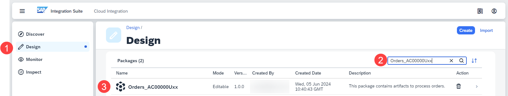
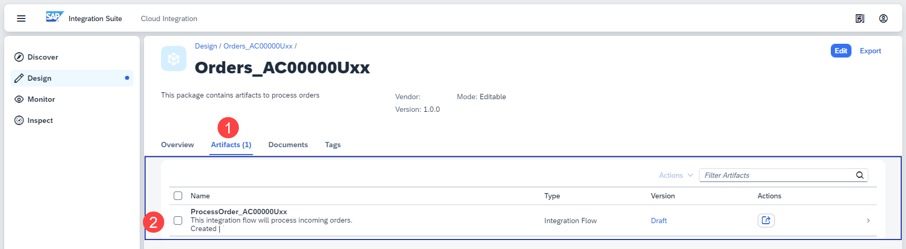
1. Click **Edit** at the top right corner of the UI.
1. In the top menu bar of the integration flow editor, select the **Message Transformers** item, then use **Converter** to select the **JSON to XML Converter **and finally drop the **JSON to XML converter** on the link between the Start and End flow steps.
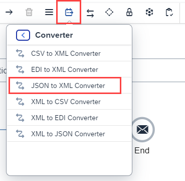
Check that the converter step is placed on the link between Start and End by dragging it around for instance.

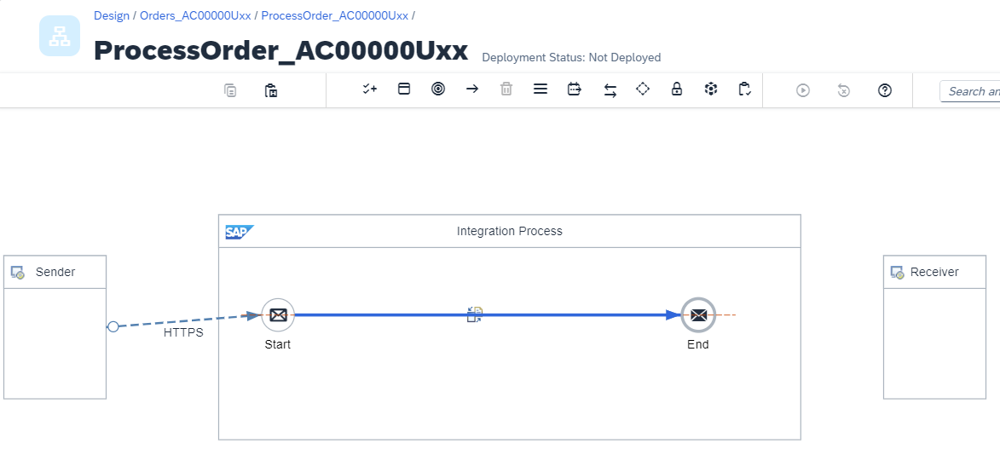
Your integration flow should look like this:

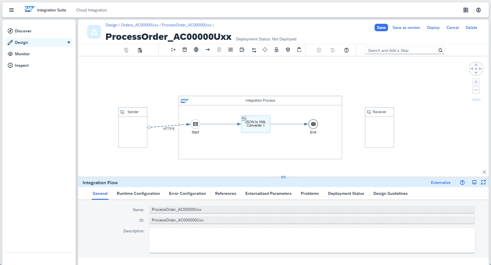

4. In the top menu bar of the integration flow editor, select the Message Transformers item and select the Content Modifier.
    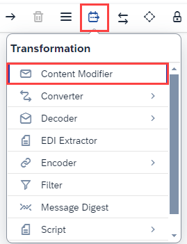
    
1. Drop the Content Modifier on the link between the Converter and End flow steps. Check that the content modifier step is placed on the link between Start and End by dragging it around for instance.
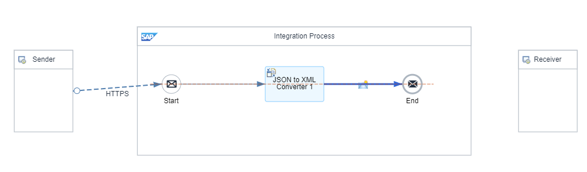
Rearrange your integration flow so that it stays clean and readable, using the handles of the various items, as well as dragging the items around.

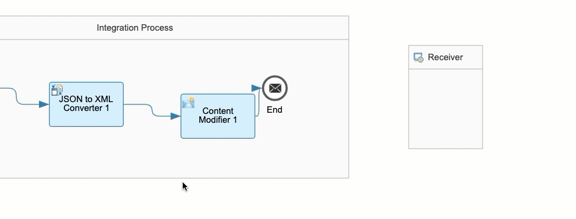
Your integration flow should look like this:

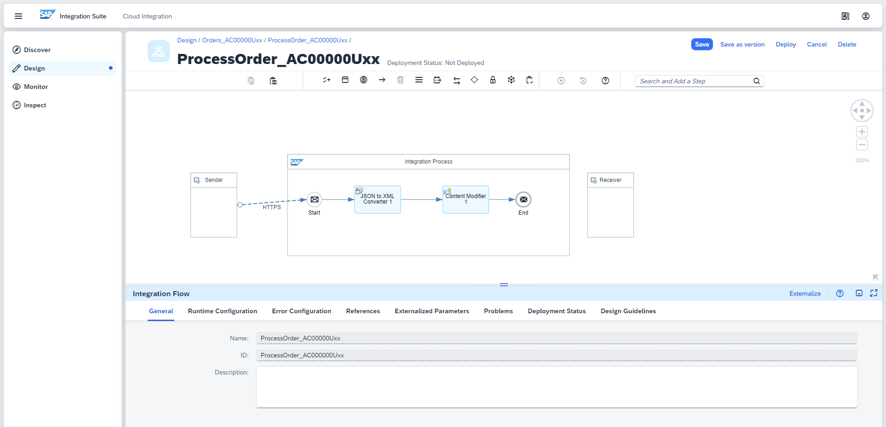

6. **Save** your work (in the upper right corner of the editor) before continuing to the next step.
The content modifier lets you interact with the payload and metadata going through the integration flow.

> **Note**: you can read the documentation of the flow steps by using the **question mark** symbol on the right of the configuration pane.


   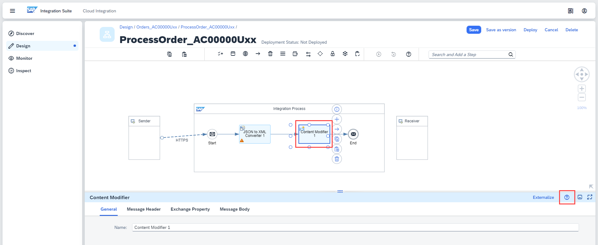
     
7. Click on the **Content Modifier** (if it is not active), open-up the configuration pane (if it’s hidden), click on **Exchange Property** and click on **Add**.
    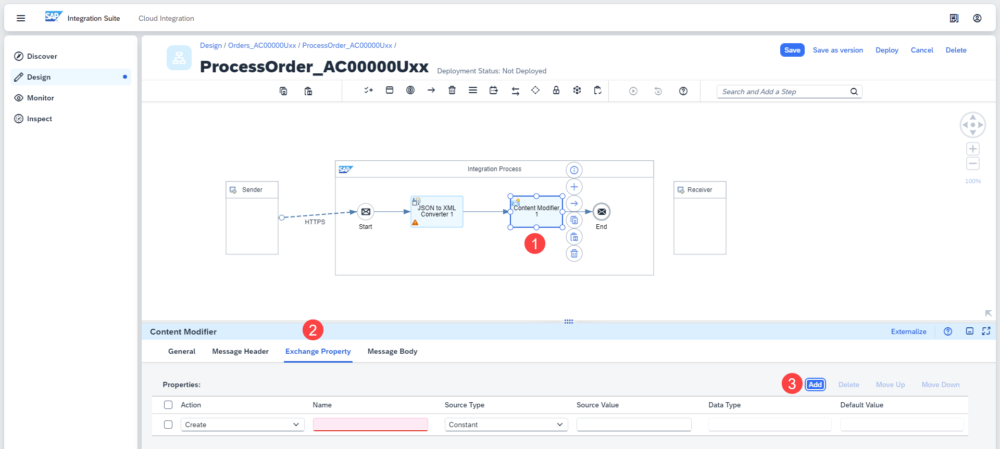
We will now read information out of the payload and store it for later use in the integration flow.

Remember that we have converted the incoming payload to XML so we can now use XPath expressions in the content modifier to read the payload elements. Once the payload elements are stored in exchange properties, we can reference them in any other part of our integration flow. In our example, we will build a dynamic SQL query.


8. Create the following Exchange Properties, you need 7 of them, all the same type, but referring to different parts of the payload.

    ---
    1. **Action**: Create
    1. **Name**: CustomerName
    1. **Source Type**: XPath
    1. **Data Type**: java.lang.String
    1. **Source Value**: //CustomerName

    ---

    1. **Action**: Create
    1. **Name**: CustomerID
    1. **Source Type**: XPath
    1. **Data Type**: java.lang.String
    1. **Source Value**: //CustomerID

    ---

    1. **Action**: Create
    1. **Name**: MaintenanceStartDate
    1. **Source Type**: XPath
    1. **Data Type**: java.lang.String
    1. **Source Value**: //MaintenanceStartDate

    ---

    1. **Action**: Create
    1. **Name**: MaintenanceEndDate
    1. **Source Type**: XPath
    1. **Data Type**: java.lang.String
    1. **Source Value**: //MaintenanceEndDate

    ---

    1. **Action**: Create
    1. **Name**: MaintenanceServiceLevel
    1. **Source Type**: XPath
    1. **Data Type**: java.lang.String
    1. **Source Value**: //MaintenanceServiceLevel

    ---

    1. **Action**: Create
    1. **Name**: Quantity
    1. **Source Type**: XPath
    1. **Data Type**: java.lang.String
    1. **Source Value:** //Quantity

    ---
    1. 
    1. **Action**: Create
    1. **Name**: OrderReference
    1. **Source Type**: XPath
    1. **Data Type**: java.lang.String
    1. **Source Value**: //OrderReference

    ---
    
This is what your content modifier should look like:

   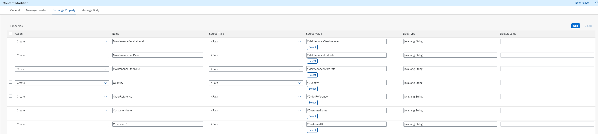
    

9. **Save** your integration flow.
    * Now that the required payload elements are stored in the exchange properties of the integration flow, let’s use them to build the SQL Query used to insert a row in the PostgreSQL database.

10. Click on **Message Body** in your content modifier.
    * The message body allows to alter the payload of the integration flow.
1. Set the **Type** to **Expression**.

1. Enter the following text as body:

```
INSERT INTO technicalacademy.maintenance_contracts
(customer_name, customer_id, start_date, end_date, service_level, quantity, order_reference)
VALUES ('${property.CustomerName}', '${property.CustomerID}', '${property.MaintenanceStartDate}', '${property.MaintenanceEndDate}', '${property.MaintenanceServiceLevel}', '${property.Quantity}', '${property.OrderReference}')
```
As you can see, we are dynamically creating the INSERT statement using the values of the payload we previously stored in the exchange properties.

This is what your content modifier should look like:

 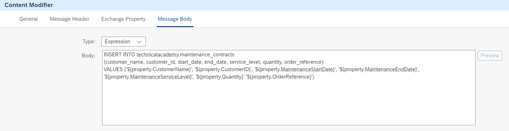

13. **Save** your integration flow. Now that the payload is properly formatted, we need to send it to the PostgreSQL database.

1. Click on the **End** flow step and drag the arrow on top of the **Receiver** box.

 

15. In the **Adapter Type** pop-up window, chose **JDBC**.

    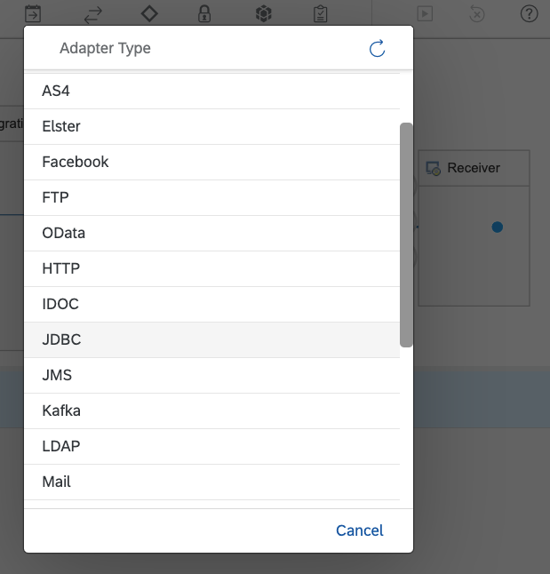

1. In the JDBC adapter configuration, click on Connection and fill-in the configuration as follows:

    * **JDBC Data Source Alias**: AC_PostgreSQL_Cloud

    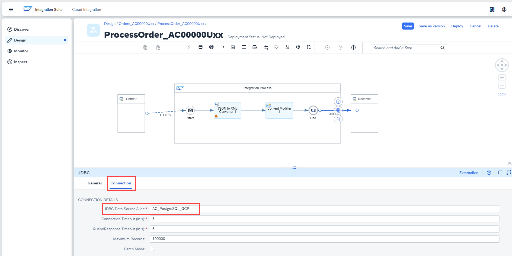
    
1. Save your integration flow.

1. **Deploy** your integration flow

    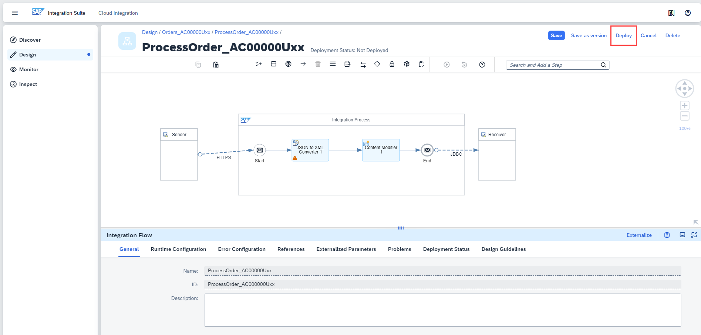
1. If the following confirmation pops up, confirm the check-box.

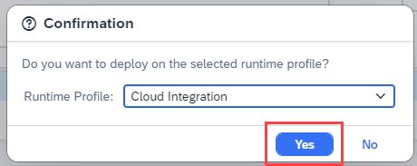

## Test the integration flow
Now that you have finished the configuration of the integration flow, let’s test it. To do so, we strongly recommend you use an API testing tool like Postman. If you want to use Postman and haven’t installed it yet, please do so now.

1. To know the URL of your deployed integration flow, navigate to the **Monitor** section if the Cloud Integration service.

    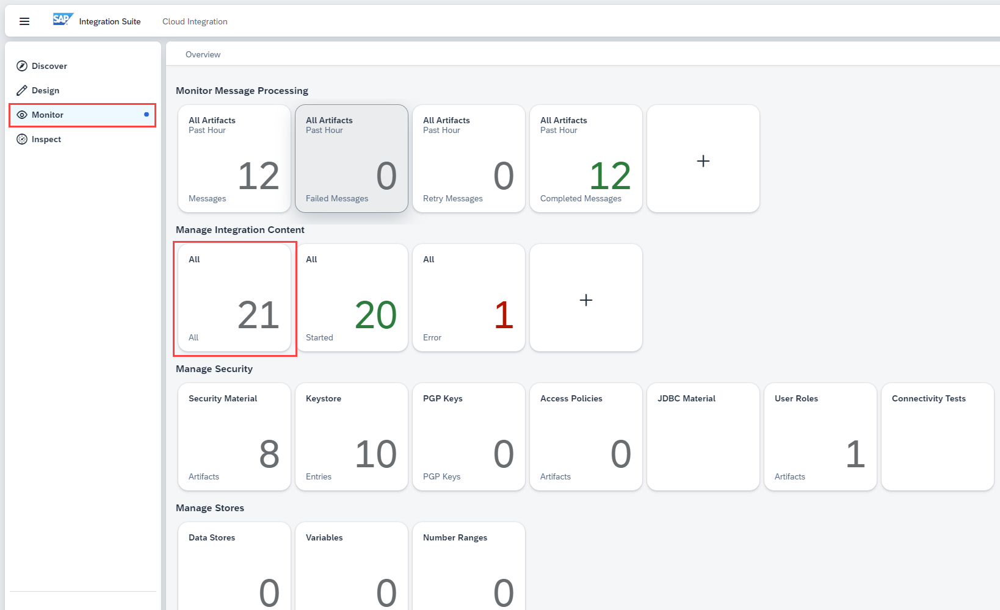
1. Locate and click on your integration flow (i.e. ProcessOrder_AC233083U01) .

1. Copy the URL using the copy/paste button.

    > **Note**: Wait for the status of integration flow to be **Started**

    
1. Configure the API testing tool of your choice so that you make an API call to the integration flow.

    * **Method**: POST
    * **URL**: The URL of your integration flow
    * **Authentication**: Basic Authentication
    * **Username**: sb-458e46de-72b0-4282-ae78-c83f4adf572c!b311693|it-rt-integration-suite-academy-us10!b56186
    * **Password**: 49675f98-e041-46a5-b8c6-fb1d8e21ceab$RAbVtKStZujcSvHrU4Kwjj0xjm2Bk2xlubJ_Eg2eBnQ=
    * **Content-type**: application/json
    * **Body**:
    ```
    {
    "CustomerName": "HighTech Sports Inc.",
    "CustomerID": "17100004",
    "ProductID": "MZ-TG-ZAD01",
    "Quantity": "1",
    "Price": "1000",
    "OrderReference": "AC233083U01-XXX",
    "MaintenanceStartDate": "25.02.2025",
    "MaintenanceEndDate": "31.12.2025",
    "MaintenanceServiceLevel": "Premium"
    }
    ```
    > Keep in mind that the order reference must beunique. **Replace AC233083U01-XXX with AC233083U01-consecutive number.**
    > 
    > **Examples**: for first Test : **AC233083U01-001** for second Test : **AC233083U01-002** for third Test : **AC233083U01-003** for n Test : **AC233083U01-n**

1. In Postman the request will look like this:

    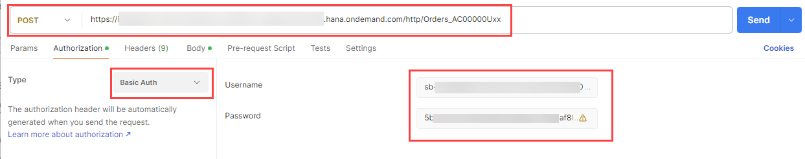
    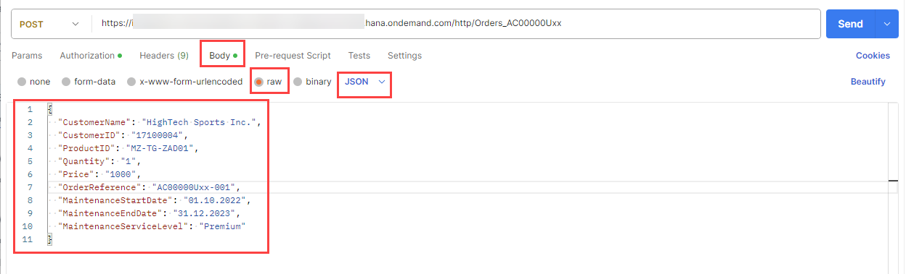
We strongly recommend that you save this request so you can re-use it in the next chapter.

1. Send the API Call and check the response: it should be a “200” HTTP code and the following message: “SQL statement returned OK, 1 row(s) affected”.

    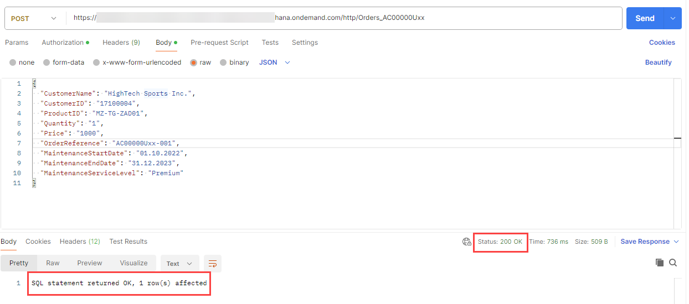
1. Your record has been created in the PostgreSQL Maintenance Contract database as you can see in the: PostgreSQL Database UI. Filter by your **Order Reference** Number.

    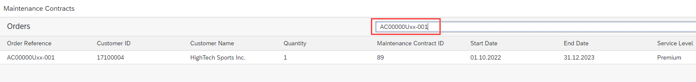
1. Check that your integration flow was successfully processed by the Cloud Integration service by navigating to the **Monitor** and **Monitor Message Processing** section.

    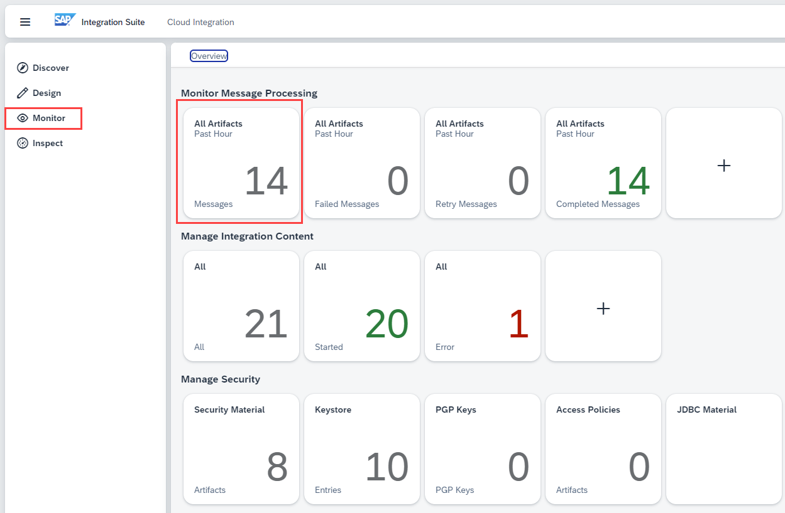
1. Search or filter for your own integration flow and click on the message(s) to display all the details - including errors if any arose.

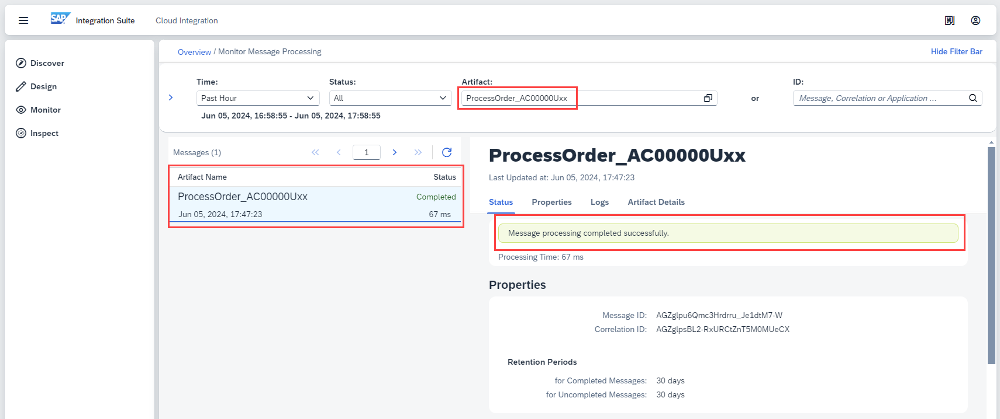
Congratulations! You are now ready for the next lesson!

# Extend the integration flow


> **Objectives**
> 
> After completing this lesson, you will be able to:
> 
> extend the integration flow so that it also writes the data into an SAP S/4HANA system.
# Process Integration – Extend the integration flow
In the previous chapter you have created an integration package and an integration flow that can be called using a REST API. In this chapter, you will refine the integration flow so that it also writes the data in an SAP S/4HANA system. Hence, once an order is created from any system using the REST API, the associated maintenance contract will be written into the maintenance contract database and in parallel a purchase order will be created in the ERP.

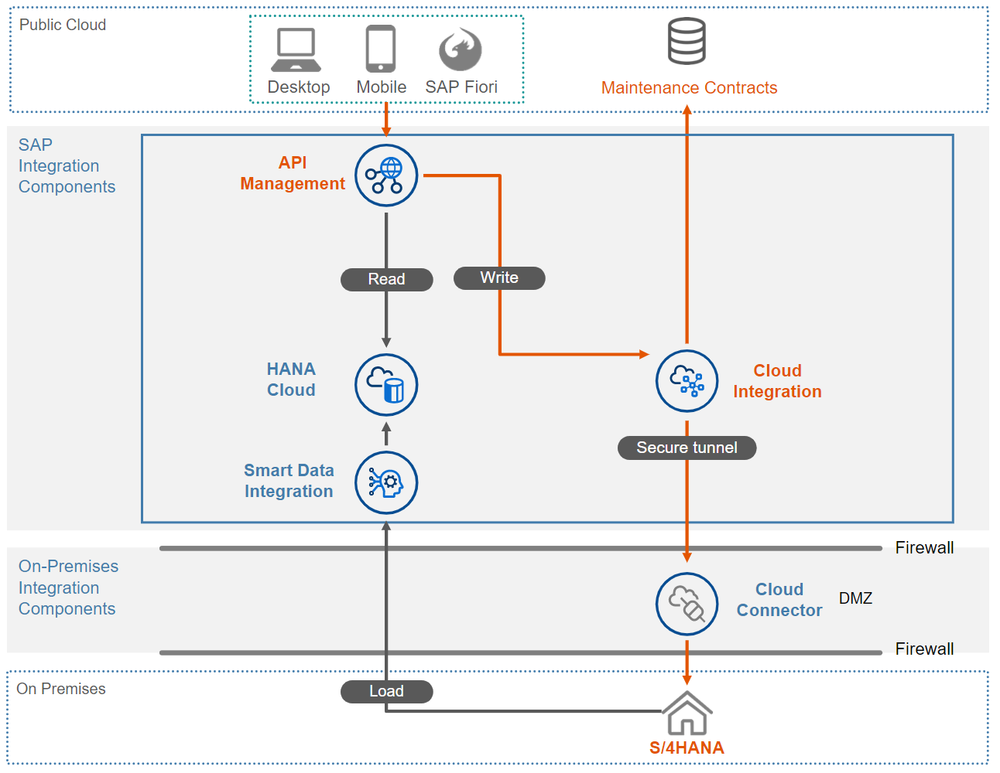
## Access the Cloud Integration service
Make sure you are inside the SAP Integration Suite - Integration and APIs section, otherwise access the SAP Integration Suite and navigate to the **Design** section in the left-hand menu.


## Extend the existing integration flow
In this exercise, you will extend the integration flow from chapter 2 to write the order in the S/4 HANA system - in parallel to the entry of the maintenance contracts database.

1. Navigate to the **Design** section of the Cloud Integration service.
1. Locate your integration package (“**Orders_AC233083U01**”) and open it.
1. Navigate to Artifacts section and Open the integration flow (“**ProcessOrder_AC233083U01**”) by clicking on it.
1. Click on the **Edit** button to start making changes.
    * We will now add a representation of the **S/4 HANA** system into our integration flow to send the sales order to it.
1. In the integration flow editor, in the palette (i.e. toolbar), click on the **Participants** icon and select **Receiver**.
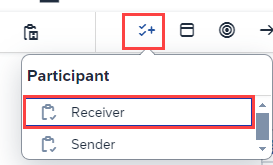
1. Position the new receiver at the right of your integration flow.

1. Rename the receiver into **S4HANA** by changing its **Name** in the properties panel at the bottom of the editor. Because we now have multiple receivers, it is a good idea to also rename the first receiver (PostgreSQL) into something more meaningful.

1. Click on the first **Receiver** (connected through JDBC) and change its name into **PostgreSQL**.

    We will now add another **end step** of our integration flow. This **end message** step allows you to send data to a receiver system after the integration flow processing is finished.

   > **Note**: the response of the system is sent back to the integration flow caller automatically when using this step. If you wanted to check the response of the system, you would rather use a request-reply step.

1. In the palette, click on **Events** and select **End message**.
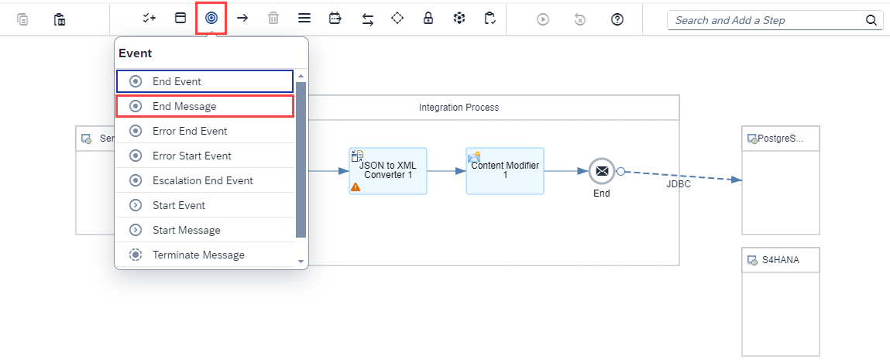
1. Position the end message flow step under the existing one, left from your S/4HANA receiver.
    * We will now connect the end of the integration flow to the S/4HANA receiver using the **OData v2** adapter.
1. Click on the **end** flow step you just added, select the arrow and click on the **S/4HANA** receiver.
    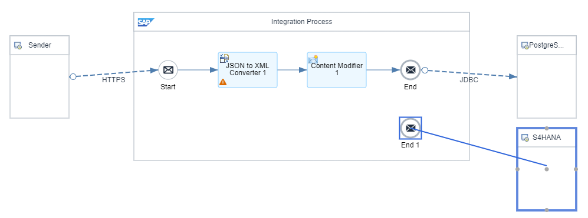
1. Select **OData** as adapter type and **OData v2** as message protocol.
    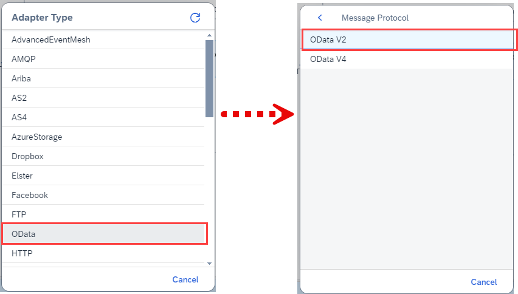
    * We will now configure the communication with the S/4HANA system. This is done through the properties of the adapter.
1. Click on the arrow between the **end** flow step and the **S/4HANA** receiver.
1. Maximize the properties pane using the button at the bottom right corner of your screen.
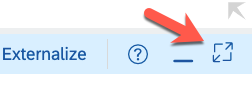
1. Configure the **Connection** as follows:
    * **Address**: https://s4-2020.sapexperienceacademy.com:44300/sap/opu/odata/sap/API_SALES_ORDER_SRV
    * **Proxy Type**: Internet
    * **Authentication**: Basic
    * **Credential name**: AC_S4_OnPrem
    * **CSRF Protected**: uncheck
    * **Reuse Connection**: check
The configuration should look like this:

    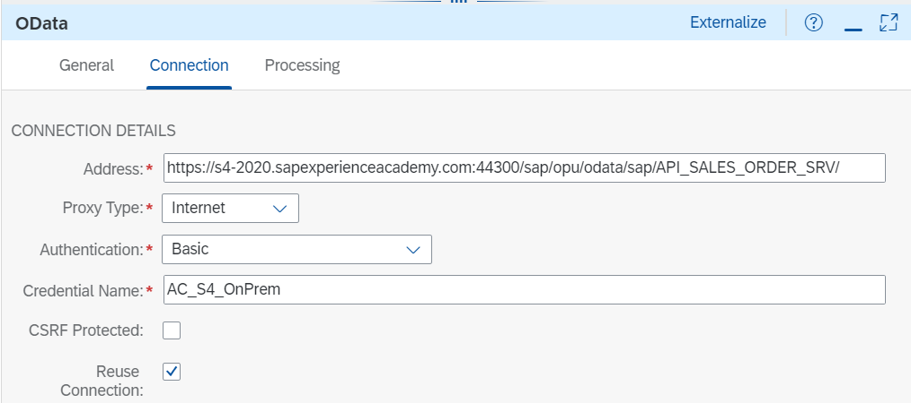
1. Now click on the **Processing** tab

1. Set the **Operation Details** to **POST**

1. Click on **Select** next to the **Resource Path** input field to open the OData wizard In the first step, notice that all field are prepopulated with the ones you have entered in the **Connection** tab.

    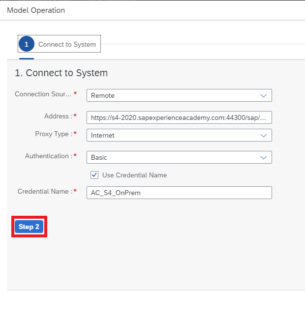
1. Click on **Step2** and configure the operation as follows:

    1. **Operation**: Create (POST) (defaulted)
    1. **Sub Levels**: 1
    1. **Select Entity**: A_SalesOrder
    1. **Generate XML Schema Definition**: checked
    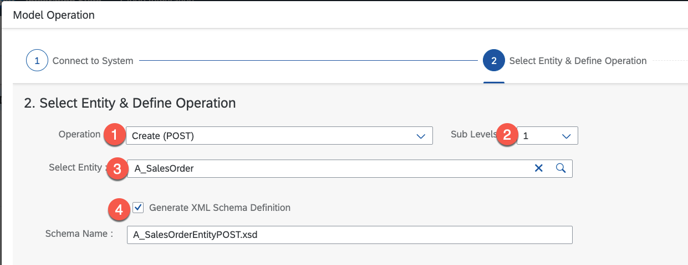
1. Select the following fields:

    1. **SalesOrderType**
    1. **SalesOrganization**
    1. **DistributionChannel**
    1. **OrganizationDivision**
    1. **SoldToParty**
    1. **PurchaseOrderByCustomer**
    1. **to_Item/Material**
    1. **to_Item/RequestedQuantity**
1. Deselect the foreign keys

    1. **SalesOrder** (at the very top)
    1. **to_Item/SalesOrder**
    1. **to_Item/SalesOrderItem**
1. Click on **Finish**.

    The configuration of your adapter should look like this:

    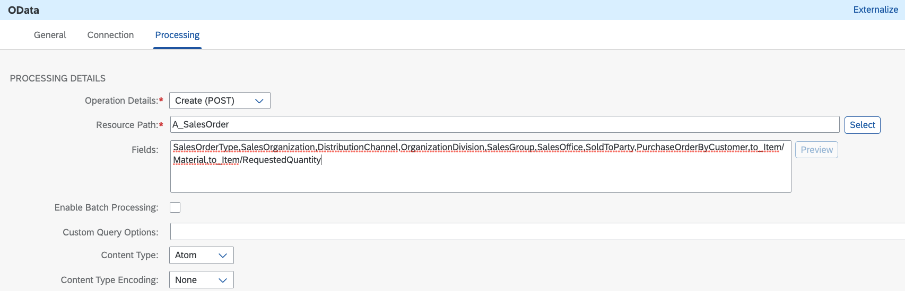
1. Click on **Save** in the integration flow editor.
## Define the mapping
We will now map the correct fields from the incoming payload onto the payload expected by the S/4HANA system. Note that we will use:

* an **OpenAPI** specification file for the incoming message
* the **XSD** message structure we have just created from the OData adapter

1. In the palette, click on **Mapping** and select **Message Mapping**.
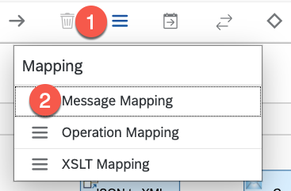
1. Position the message mapping flow step to the left of the **End** flow step you created previously.
1. Connect the **mapping flow** step to the **end** flow step.
    > Note that there are 2 different approaches for this tutorial step.
    > 
    > You can do the first approach, **Import the Mapping** to save some time.
    > 
    > You can instead do the second approach, **Manual steps**, which will teach you about how to create such mappings.
    > 
    > In the interest of time, you will follow the **Import the Mapping** approach. However, the **Manual steps** approach is available as an optional exercise.

## Import the Mapping
1. Download the [ZIP file](https://da4ug0lohul1.cloudfront.net/prod/AcademyContentFileImage/TA_Integration-Suite/223_TA_BTP-INT_Process-Integration/Files/MM_APP_TO_S4.zip) locally.
1. Click on an empty spot of your integration flow canvas.
1. Click on **References**
1. Click on **Add**
1. Click on **Mapping**
1. Click on **Message Mapping** >
    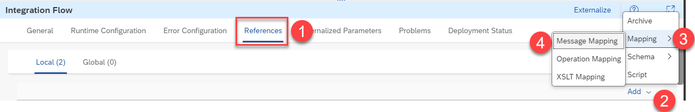
1. Select the ZIP file you have downloaded and click Add >
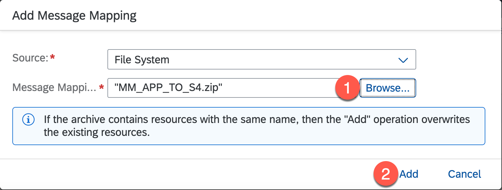
1. Click on your **Message Mapping 1** flow step
1. Click on the **Processing** tab.
1. Click on the **Select** button.
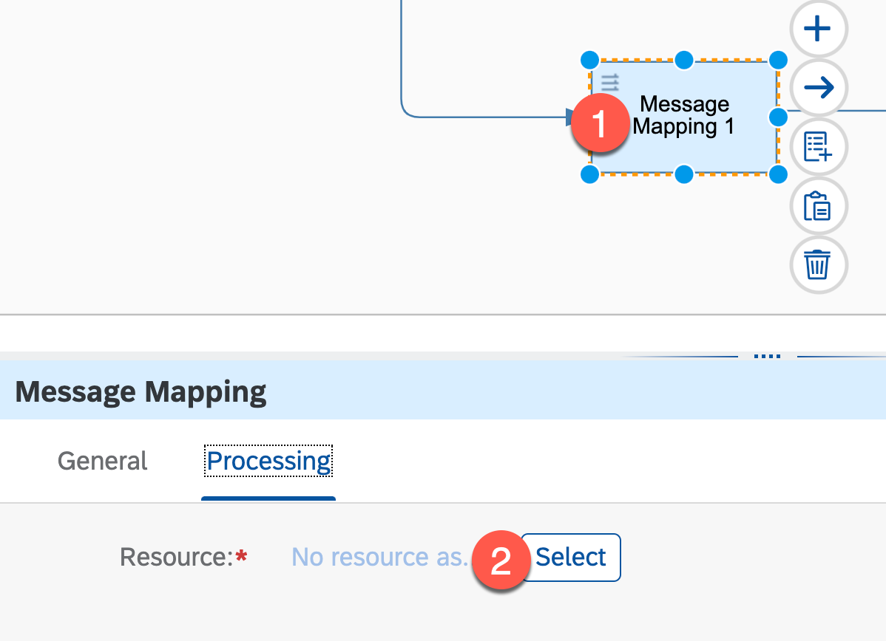
1. Select the mapping you just added and click OK >
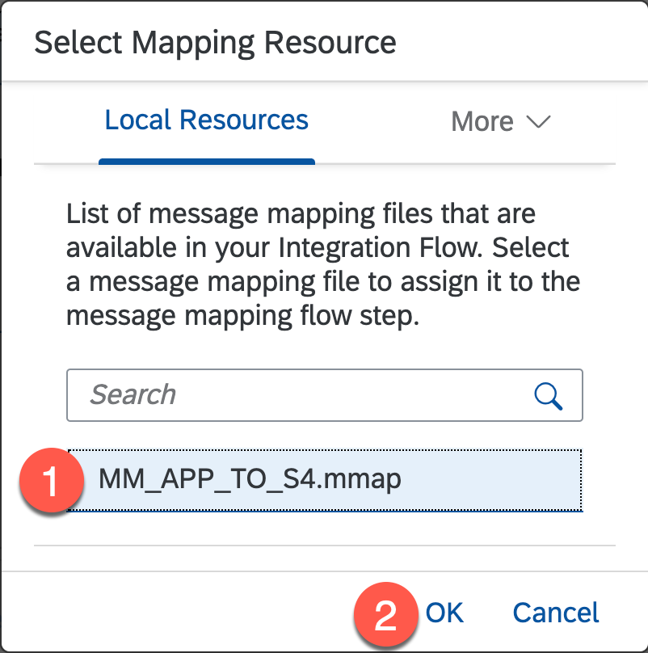
## Orchestrate the integration flow
We will now finish the configuration of the integration flow by parallelizing the execution of the communication with the Azure PostgreSQL and the S/4HANA system.

1. Click on the **Routing** icon of the palette, select **Multicast** and then **Sequential Multicast**.
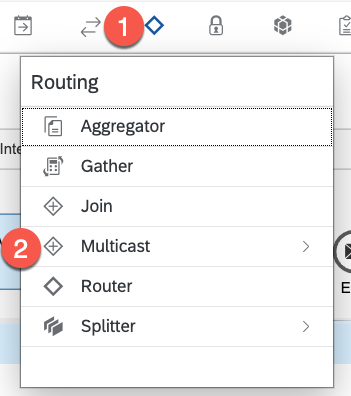
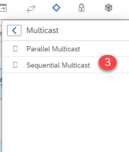
1. Click on the line between the **Start** and **Converter** flow steps. The line should highlight **green**.
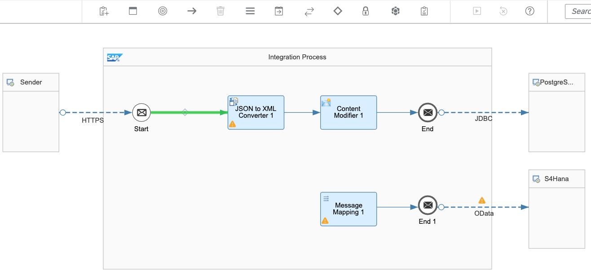
1. Select the **Multicast** flow step and then drag and drop the **arrow** of the contextual menu to the message mapping created previously.
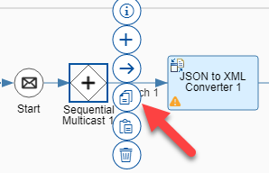
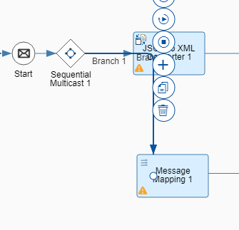
1. Beautfy your integration flow by using the blue dots and the anchors of the flow steps.
    
    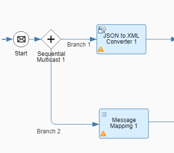
Your integration flow should now look something like this:

    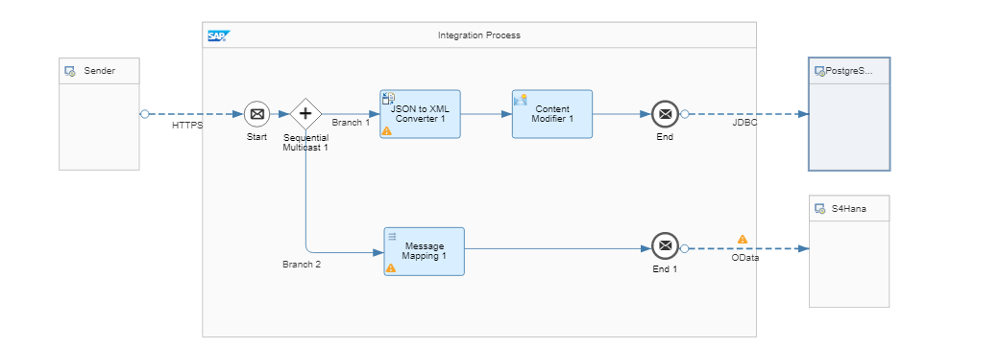
1. **Save** and **Deploy** your integration flow so that we can test it.
## Test the integration flow
1. Reuse the API Call you made in the previous chapter in order to test the new integration flow. The endpoint has not changed so just execute the request from Postman (or any other tool of your choice).
    > Still keep in mind that the order reference must be unique. Replace PXXXXXX-*** with AC233083U01-consecutive number.
    > 
    > Examples: for fifth Test : AC233083U01-005 for sixth Test : AC233083U01-006 for n Test : AC233083U01-n

If everything goes fine, the response of the integration flow should be a **201** code as depicted below.

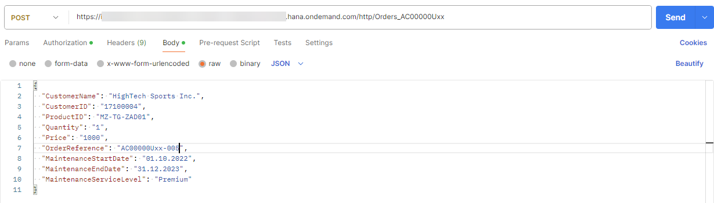
Note: Please do note down the **Sales Order** Number as we will be using it in exercise 4.

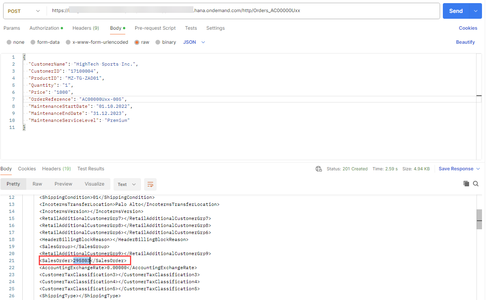
2. Check the data in PostgreSQL Maintenance Contract Database using UI exposing its data. UI_Link. Filter by your Order Reference Number.

> **Note**: In case you did not have time to go through all steps, you can also import the integration flow from the Files folder. To do so, navigate to your Integration Package Orders_AC233083U01.
> 
> 1.Click on **Edit**
> 2.Click on **Add** and select **Integration Flow** >
> 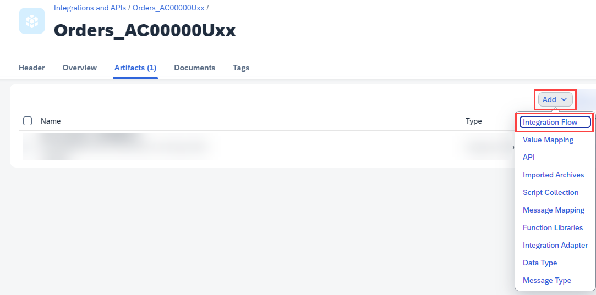
> 3.Click on **Upload**, then select the file through the **Browse** button, and **rename** your integration flow to ProcessOrder_AC233083U01. In case you already have an integration flow with the same name, rename the integration flow with something like ProcessOrder_AC233083U01_2.
> 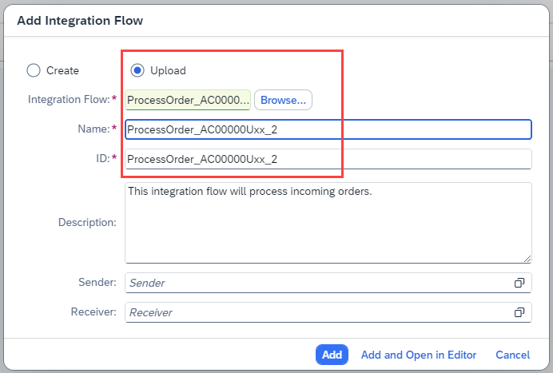
> 4.The URL for each integration flow musst be unique, so if you have already deployed an integration flow with the same URL, you will need to change that too. Click on the HTTP adapter, on the **Connection** tab and change the Address to **/Orders_AC233083U01_2** for instance.
> 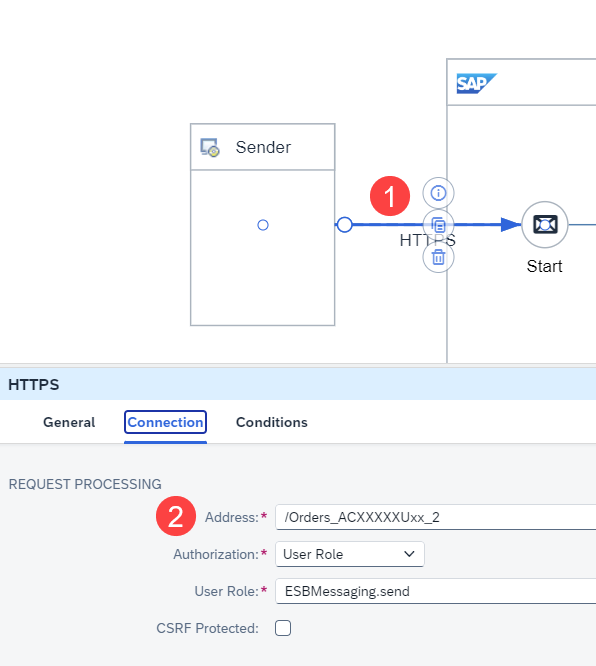
> 5.Deploy and test as described above.

Congratulations! You are now ready for the next lesson!


# Access integration flow over API Management


> **Objectives**
> 
> After completing this lesson, you will be able to:
> 
> import the model of the REST API into the API Management service of the SAP Integration Suite and publish it.
# Process Integration – Access integration flow over API Portal
In the previous lesson you have created an integration package and an integration flow that can be called using a REST API. To provide this REST API to the developers or integration experts in a secure and documented manner, you will import it into the API Portal service of the SAP Integration Suite.

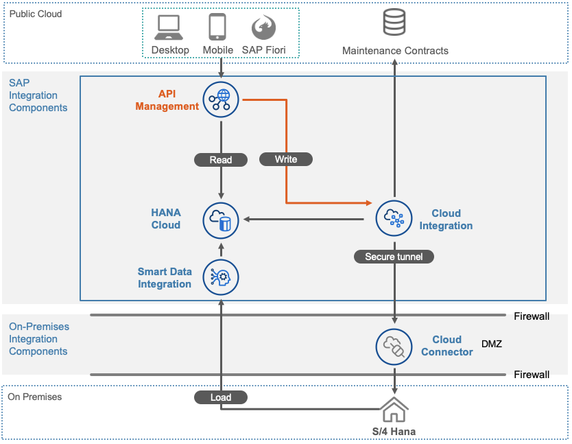
## Create an API Proxy
In this part of the lesson, we will import the model of the REST API that we have created in the integration flow.

1. Follow the link to the [API Portal](https://integration-suite-academy-us10.apiportal.cfapps.us10.hana.ondemand.com/).

1. Open the **OpenAPISpec.json** file that you have downloaded locally at the beginning of the Technical Academy: [OpenAPISpec.json](https://da4ug0lohul1.cloudfront.net/prod/AcademyContentFileImage/TA_Integration-Suite/223_TA_BTP-INT_Process-Integration/Files/OpenAPISpec.json)

1. Locate the **servers** configuration and modify the “url” element so that it matches the URL of your integration flow created previously.

    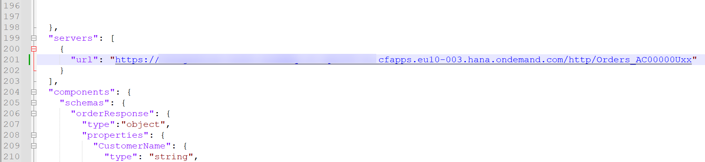
1. Save the file.

1. In the API Portal service, click on **Develop**.

1. Click on **Import API**, select the **OpenAPISpec.json** file you have previously changed and click on **OK**.

    
1. Add **_AC233083U01** to the end of your API name and select **Save**.
    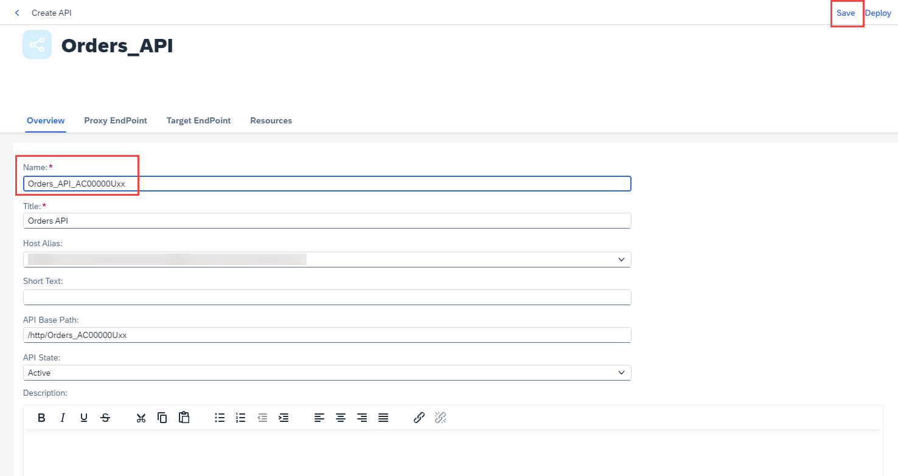
1. The API Proxy has been created, based on the OpenAPI specification. **Deploy** it using the upper right corner menu.
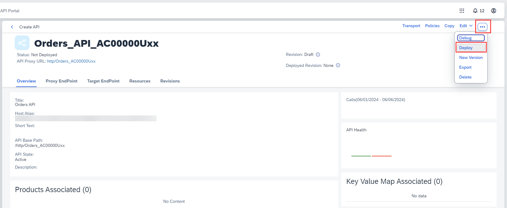
## Publish the REST API
As you did before, you will publish the **Orders_AC233083U01** API proxy to the Developer Hub.

1. In the API Management service, click on the Develop menu item on the left-hand side, then on the **Products** tab and finally on the previously created **API product**.
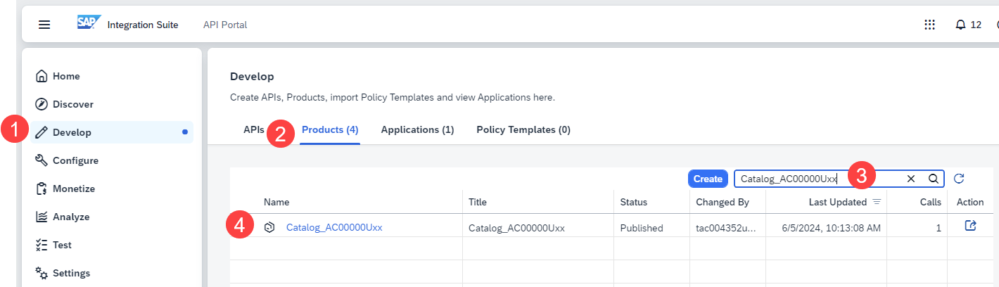
1. On the top-right corner, click on **Edit**.
1. Now select the **APIs** tab and click on **Add**.
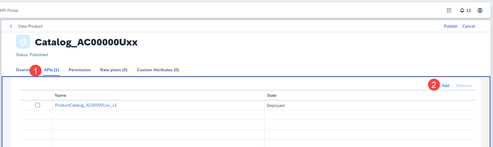
1. Select the previously created **Orders_API_AC233083U01** API and click on **OK**.
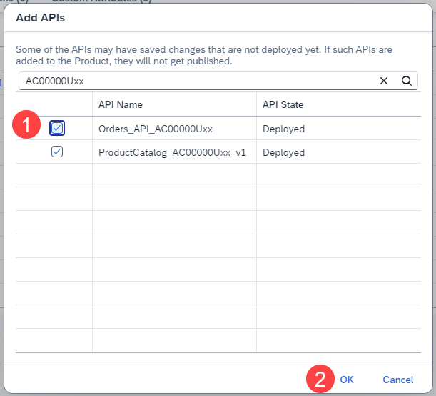
1. On the top-right corner select **Publish**.
1. Now open the **Developer Hub** using the menu on the top-right corner.
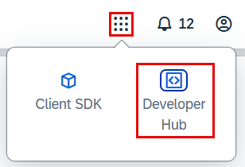
1. Navigate to your own **Product Catalog AC233083U01** API product and see that the **Orders** API has been published there.
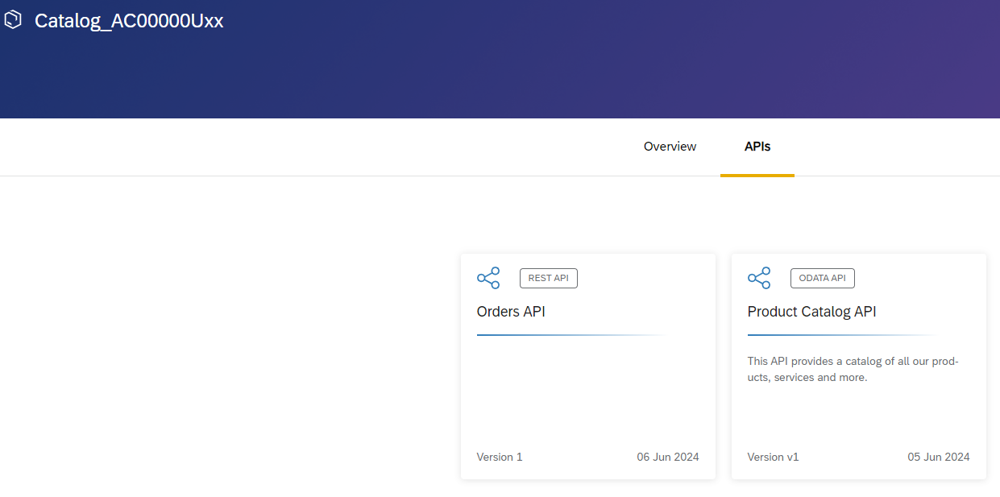
1. Select **Orders API**.

1. Copy the API Proxy URL.
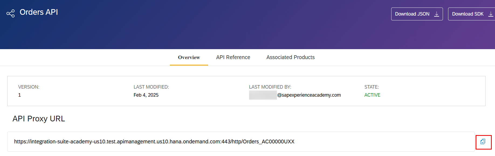

## Test the API proxy
1. Open the testing tool of your choice (e.g. Postman) and update the URL of your integration flow to use the API proxy URL. Alternatively, you can duplicate your existing test scenario and update the URL in the new version.
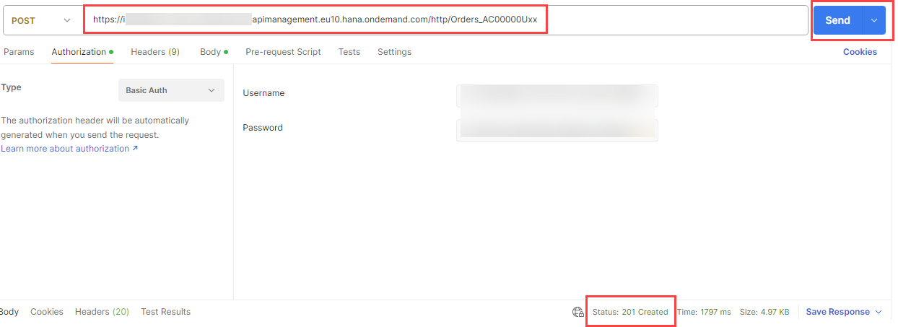
1. **Send** the request - just as you did with a direct call to the integration flow. If everything goes well, you have just triggered your integration flow through API Management. For now, API Management only acts as pass-through, but you could easily add security, traffic management, documentation, etc., just as you did before. For now, we will only publish it to the API Business Hub Enterprise.

Congratulations! You have successfully completed the last lesson of the **Process Integration** unit!


# [OPTIONAL] Define the mapping - Manual Steps
> Note that there are 2 different approaches for this tutorial step.
> 
> You can do the first approach, **Import Mapping** to save some time.
> 
> You can instead do the second approach, **Manual steps**, which will teach you about how to create such mappings.
> 
> In this lesson, you will follow the **Manual Steps** approach.

1. In the contextual menu of the mapping flow step, click on the create button.
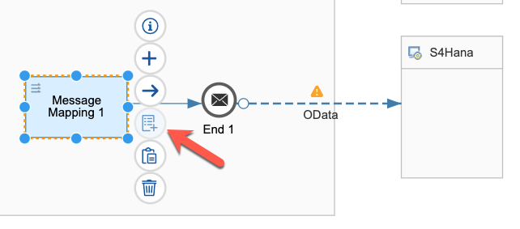
1. Enter the following name as mapping name: **MM_APP_TO_S4** In the mapping editor we will now select the **source** and the **target** message structures.

1. Click on **Add source message** and then on **Upload from file system**

1. Select the **OpenAPISpec.json** file from your local device (that you copied at the beginning of the Technical Academy). You can download that file again from [here](https://da4ug0lohul1.cloudfront.net/prod/AcademyContentFileImage/TA_Integration-Suite/223_TA_BTP-INT_Process-Integration/Files/OpenAPISpec.json).

1. In the next steps, select the right message structure from the OpenAPI specification

    1.** /Orders**
    1. **POST**
    1. **REQUEST**
1. Click on **Add target message**

1. Select the **A_SalesOrderEntityPOST.xsd** message structure. It has been created when you defined the processing details of the OData adapter.

1. Your mapping should look like this for now:

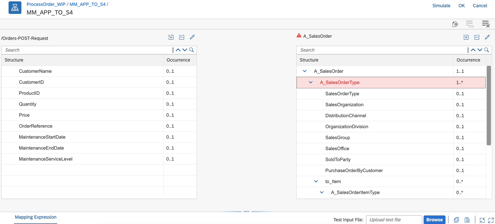
### Create the Full Mapping in the Cloud Integration Service
Mapping is one of the most important parts in an integration project hence we will spend some time in the mapping editor now, in order to build the following mapping:

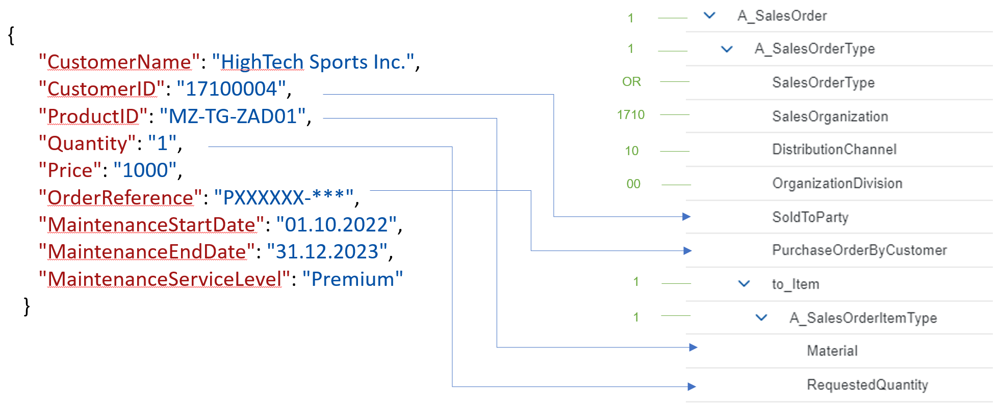
> **Note**: the next steps will guide you through creating a full mapping in the Cloud Integration service.
> 
1. Click and hold the source field on the left side and drag the end of the line to the target field on the right side.

1. Repeat for the following fields:

    1. **CustomerID -> SoldToParty**

    1. **ProductID -> to_Item / A_SalesOrderItemType / Material**

    1. **Quantity -> to_Item / A_SalesOrderItemType / RequestedQuantity**

    1. **OrderReference -> PurchaseOrderByCustomer**

    The result will look something like this:

   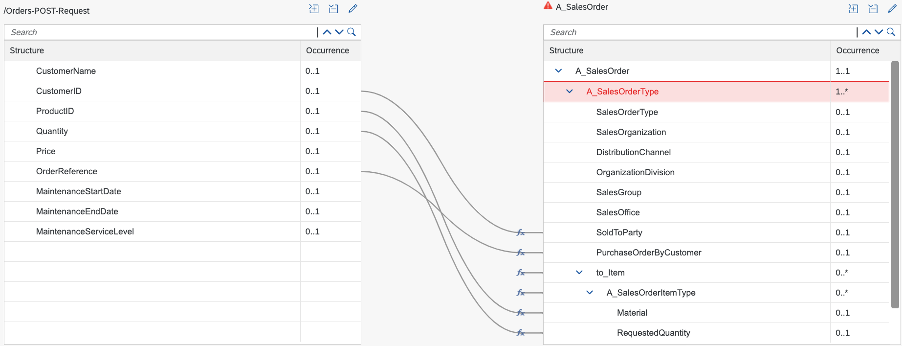
   * As you can see, some fields will require (based on the schema definition) some values. However, these values are of no importance because they will be created in the S/4 HANA system when an order is created. To stay compliant with the data model, simply assign a constant to these fields.

1. Hover over the **A_SalesOrderType** target message field on the right and click on the symbol that appears.

1. Select **Assign constant**.

    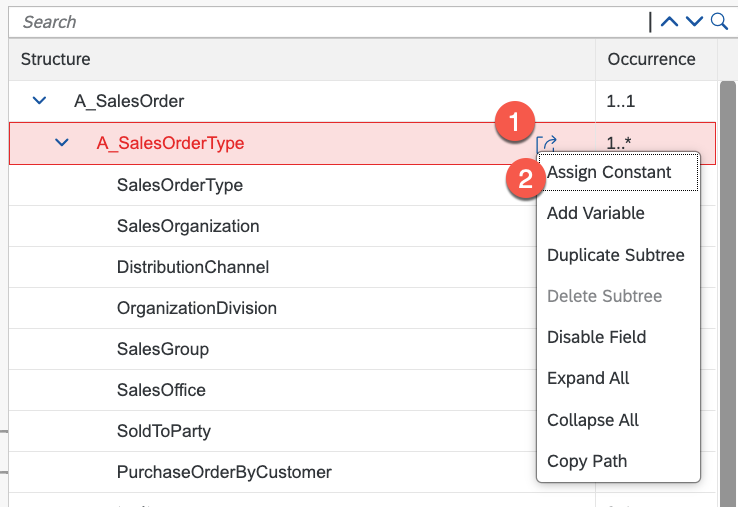

1. Repeat for the following fields:

    1. **to_Item**
    1. **A_SalesOrderItemType**
    
    The end result looks something like this.

   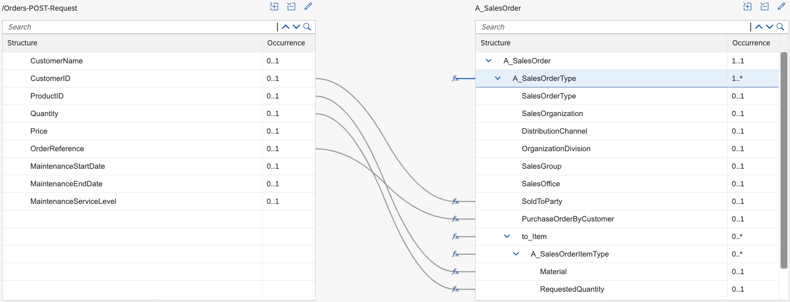

   * As you can see, the target message is still missing some fields. The values of these fields could be calculated, looked up or sent by the calling system, but in our example, we will simply assign constants to them.

    In the next steps, you will see how easy it is, in a no-code approach, to dynamically fill fields during mapping. If needed, coding can be added though.

1. Hover over the **SalesOrderType** target message field on the right and click on the symbol that appears (as you did before).

1. Select **Assign constant**.

1. Navigate to the **Mapping Expression** at the bottom of your screen, and resize it as needed.

1. In the **Constant** field of the mapping expression, enter **OR**.

    Your mapping expression should look like this:

   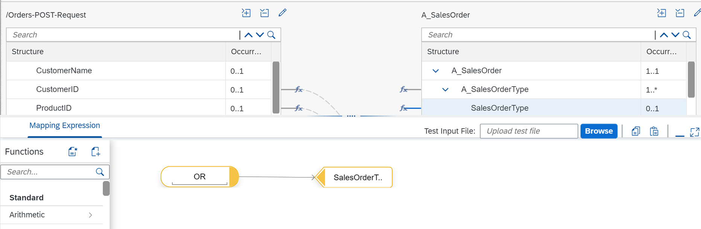

1. Just as you did before, assign constants and their values to the following fields:

    1. **SalesOrganization**: 1710
    1. **DistributionChannel**: 10
    1. **OrganizationDivision**: 00
    
Your mapping should now look something like this:

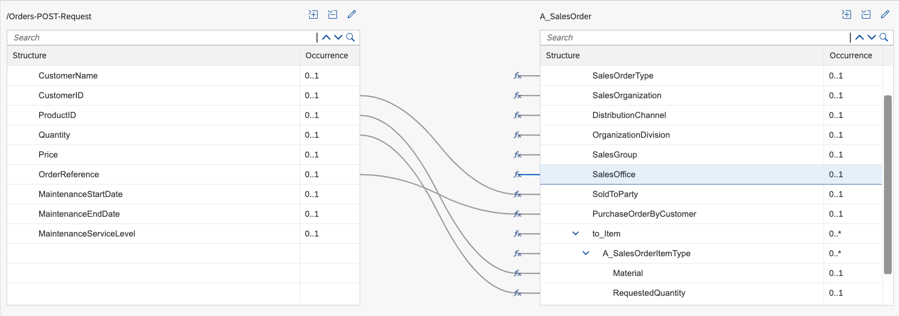
Click on **OK** in the mapping editor and **Save** your integration flow.