# Overview


> **Objectives**
> 
> After completing this lesson, you will be able to:
> 
> familiarize yourself with the concepts of eventing.


# SAP Integration Suite - Eventing
## Script Overview
### Highlights
In this section, you will familiarize yourself with the concepts of eventing.

Events allow us to react to changes, by informing that something has changed.

In our scenario we will use event mesh to synchronise the quantity from Sales Orders and Maintenance Contracts.

During the course of this exercise, you will create a queue that will receive changed order events. Next, you will build an iflow to consume the changed order data and update the maintenance contract database.

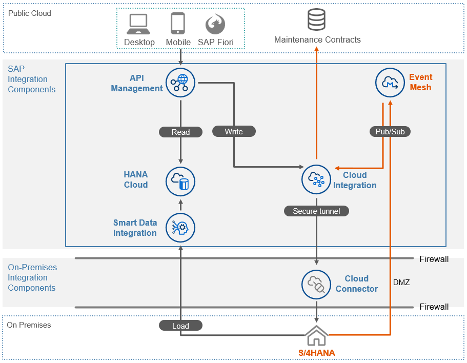
### Prerequisites
* Your Session-User, provided via mail or by your instructor
* Access to the landing page of your Session-Account via link, provided via mail or by your instructor
### Goal
The goal of this section is to configure Event Mesh and SAP Cloud Integration to react on the changed quantity of a sales order in S/4HANA and update the related Maintenance Contracts database.

### Further information
[SAP BTP Event Mesh documentation](https://help.sap.com/viewer/bf82e6b26456494cbdd197057c09979f/Cloud/en-US/df532e8735eb4322b00bfc7e42f84e8d.html)
### Exercise map
In the following chapters of this exercise you will use SAP Event Mesh.


# Introduction to Eventing


> **Objectives**
> 
> After completing this lesson, you will be able to:
> 
> configure the SAP Event Mesh service to handle a Cloud event.

# Eventing – Event Mesh Queue
In this chapter, we will try to listen to the events created in the **S/4 HANA** On-Premise system, when we change an already created sales order from the previous exercise.

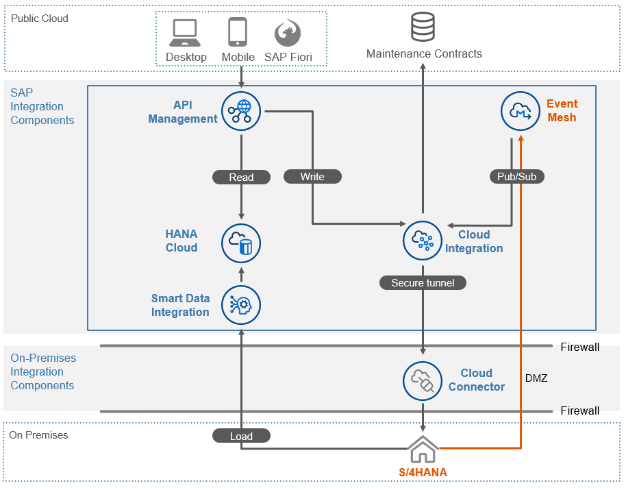
## Backend Setup
There is no need for the participants to do the backend setup as it is a one time activity that we already done in the setup.

Please find the details on the configuration in the following video.

**Please find the reference blogs that we used for the setup**

[Configure SAP Event Mesh for SAP S4HANA on premise via service key](https://blogs.sap.com/2021/02/15/configure-sap-enterprise-messaging-for-sap-s-4-hana-on-premise-2020-via-service-key/)

[Publishing events from S4HANA to Event Mesh for Cloud Integration for external systems](https://blogs.sap.com/2021/10/28/publishing-events-from-s-4-hana-to-event-mesh-for-cloud-integration-for-external-systems/)

[Enable SAP Cloud Integration to consume messages from Event Mesh](https://blogs.sap.com/2022/06/14/blog-post-enable-sap-cloud-integration-suite-to-consume-messages-from-sap-event-mesh-service/)

## Access the Event Mesh
1. Follow link for the [SAP Event Mesh](https://integration-suite-academy-us10.enterprise-messaging.cfapps.us10.hana.ondemand.com/) service
## Configure Event Mesh Queue
1. Go to **Message Clients**

1. Select Message client named **ems**

    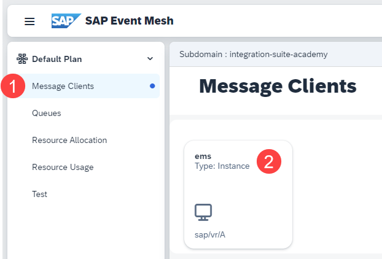

1. Click **Queues => Create Queue**

    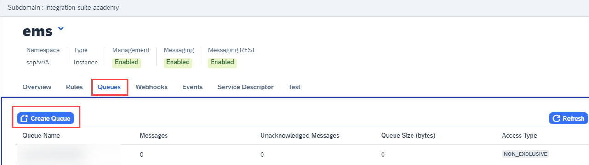

1. In Queue Name: **AC233083U01** and select **Create** button to create queue.

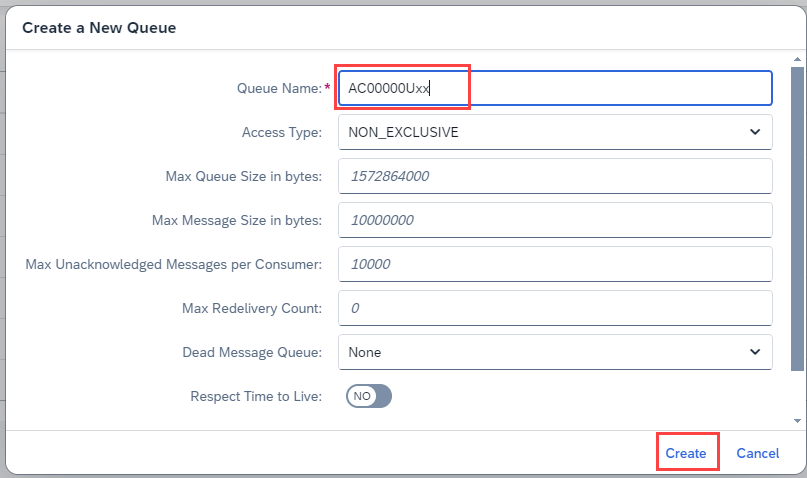
## Subscribe to a Topic in Event Mesh
1. Click on the action button and select **Queue Subscriptions**

    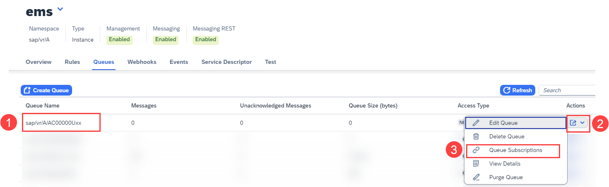

1. Enter Topic : sap/vr/A/s4/ta/**AC233083U01**/*

    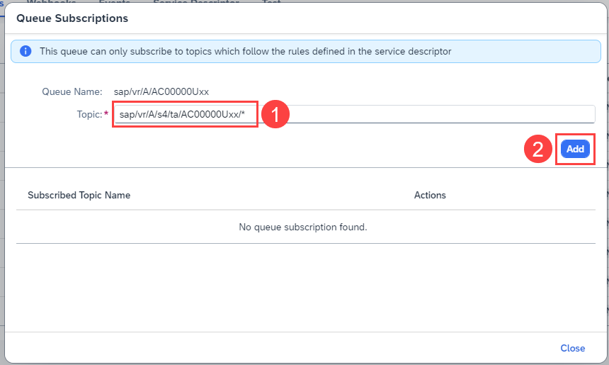
Select **Add**.

1. Select **Close**

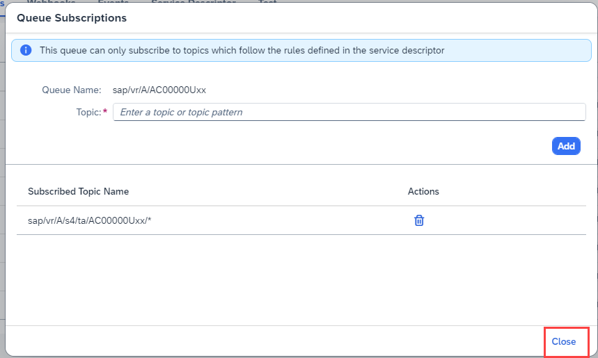

## Testing Queue
We will test our created queue by changing the order quantity which was created in previous exercises (Chapter 3 exercise 3). Queue will listen to changes made to your sales order details.

1. Click on: S/4 HANA to open the SAP Fiori Launch Pad

1. Login to System using

    * Your Login user: AC233083U01 and
    * Your password, provided via mail or by your instructor
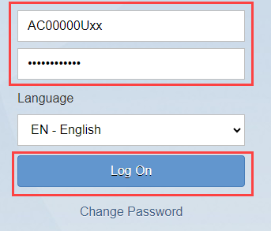
1. Select tile **Change Sales Order** (VA02)

    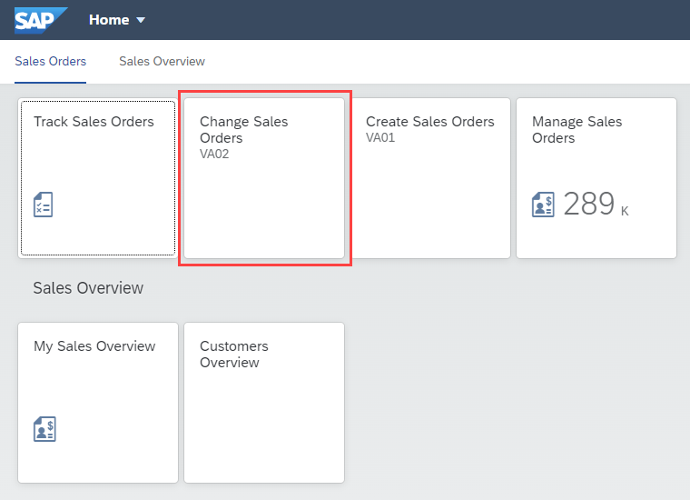

1. Enter the **Sales Order** number which you got in the Process Integration exercise (Unit 3, Lesson 3) using the Postman tool and select **Continue**.

    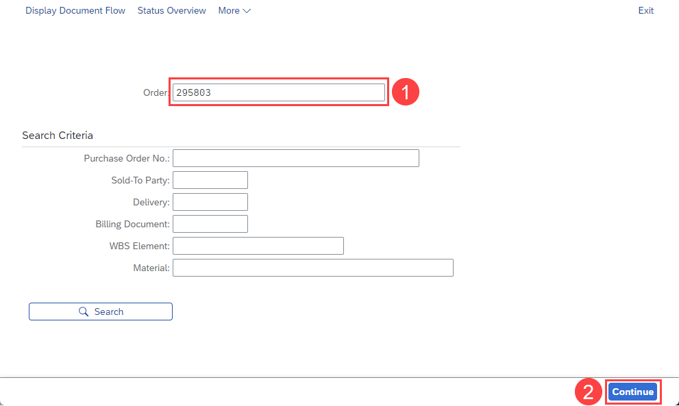
1. Match your order reference number and change the **quantity** and then do **save**.

    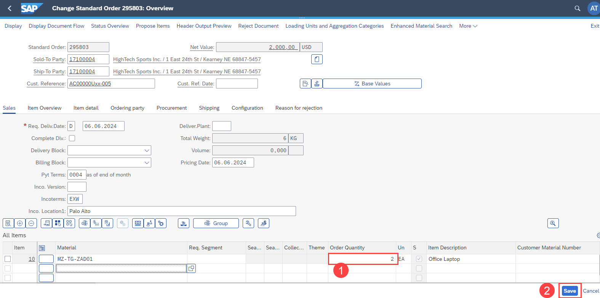
1. Open **Event Mesh** and select your **Queue** by searching your userid. You can see now 2 messages in your Queue. One message is notification of change and other contains changed quantity data.

    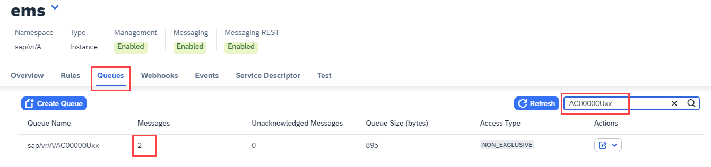
1. Go to **Test** tab to see the data.

    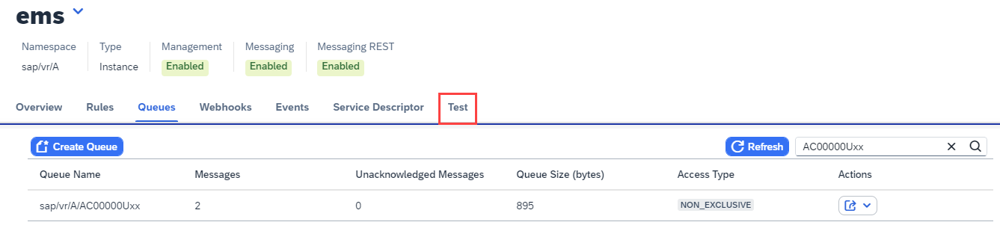
1. Select your **Queue** in **Consume Message** part. Now select **Consume Message**

    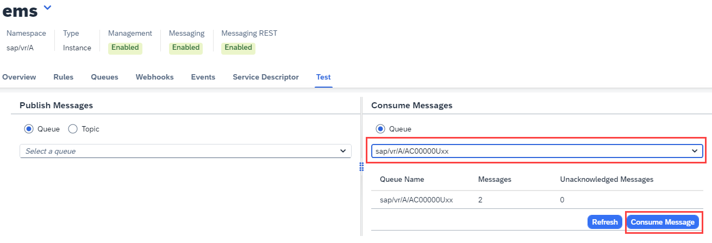
1. First notification message.

    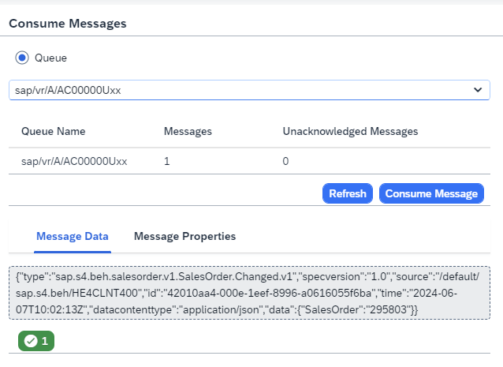

1. Again click on **Consume Message** to see Data.

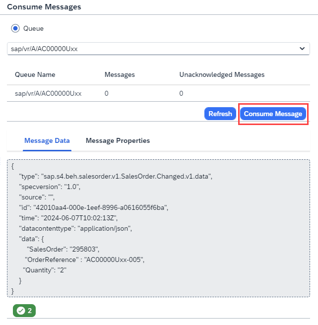


# Consume Events in Cloud Integration


> **Objectives**
> 
> After completing this lesson, you will be able to:
> 
> consume events and update maintenance contracts.


# Eventing – Integration Flows
In this chapter we will learn to update the Maintenance Contract database in **PostgreSQL** using the updated quantity in **S/4 HANA** with help of **SAP Event Mesh** and **SAP Cloud Integration**. As the conclusion from chapter 1 we found out that we can use data event to get the needed information to update the maintenance contract. So we need to unsubscribe the old topic and subscribe to only data topic.

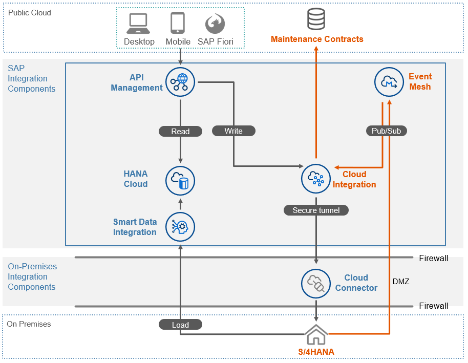
## Configure Event Mesh Queue
1. Go to **Message Clients**

1. Select Message client named **ems**

    
1. Select already created Queue Name : **sap/vr/A/AC233083U01** .

1. Select **Queue Subscriptions** from action button.

    
1. **Delete** topic `sap/vr/A/s4/ta/AC233083U01/*` from the subscription.

    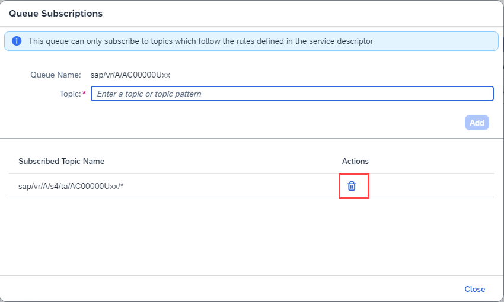

1. Enter Topic : `sap/vr/A/s4/ta/AC233083U01/data`

    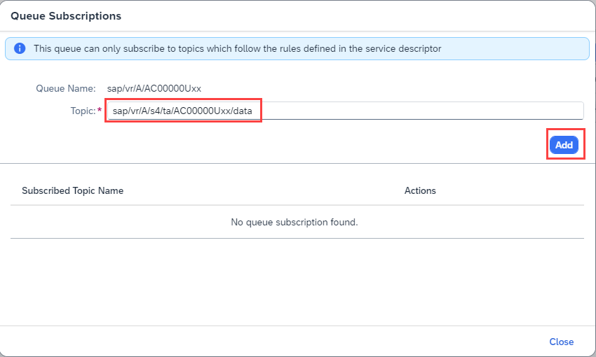
1. Select **Add**.

1. Select **Close**

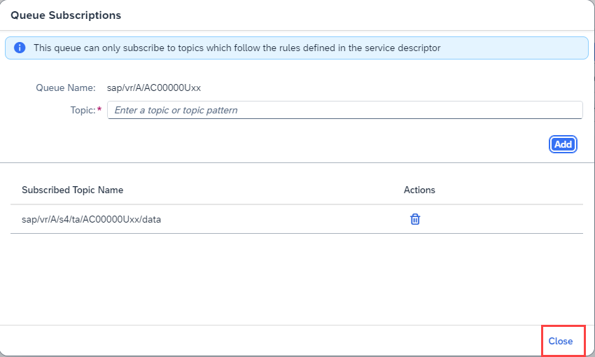
Switch back to the SAP Integration Suite - **Integration and APIs** window, or access it via [SAP Integration Suite](https://integration-suite-academy-us10.integrationsuite.cfapps.us10-002.hana.ondemand.com/shell/home) and navigate to the **Design** section in the left-hand menu.

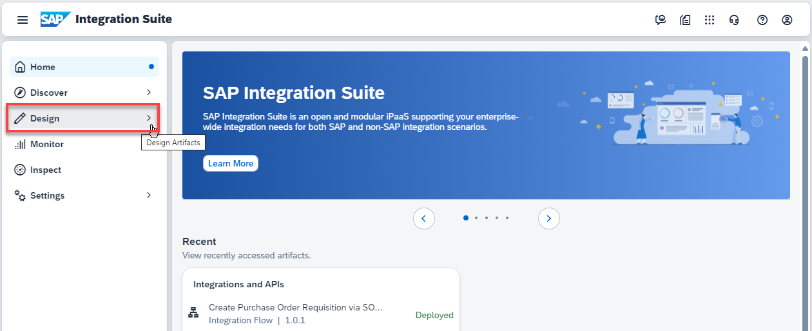
## Create the integration flow
When you log into Cloud Integration, you can discover and download predefined integration packages. These packages contain artifacts like integration flows that implement specific use cases. This content is delivered and supported by SAP (or partners) and can be used to quickly implement specific integration projects.

1. Please browse to existing integration packages **Orders_AC233083U01** created in the Proceess Integration exercise (Lesson 3).

    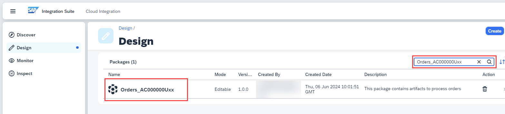
1. In the Cloud Integration service, within your package, click on the **Artifacts** tab and then select **Edit** button to make changes.

    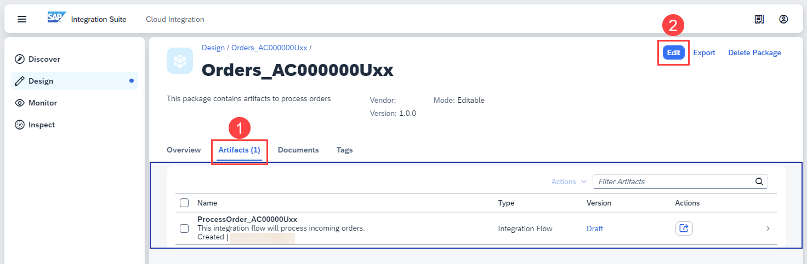
    > **Note** : If you don’t want to create iflow and want to import it then please scroll down to the section **Import Iflow**.

1. Make sure that you are in **Edit** mode (**Save** is displayed instead of **Edit**) of the package and click on **Add** and select **Integration flow**.

    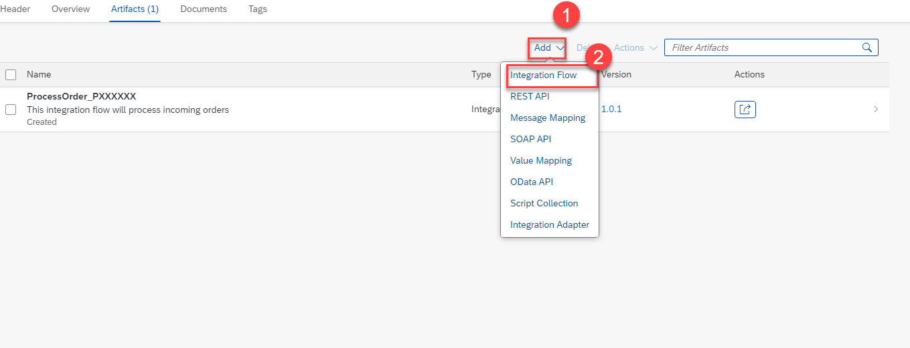
1. Fill in the fields as follows:

    * **Name**: **Update_Maintenance_Contract_AC233083U01**

    * **ID** will be auto-filled with **Update_Maintenance_Contract_AC233083U01**

    * **Description**: “This integration flow will process(update) Sales orders”

    * The fields **Sender** and **Receiver** are not relevant for now.

    * Click on **Add**

    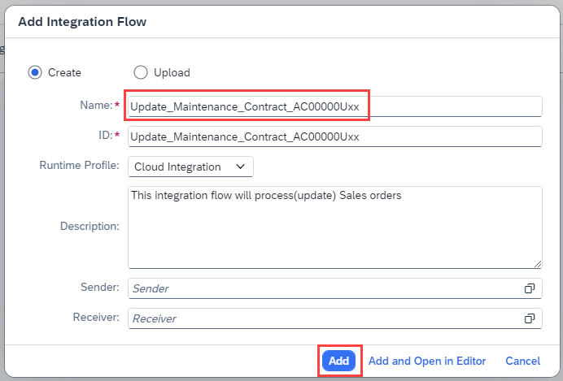
1. Your integration flow has correctly been created, and you can now access it by clicking on the row containing the artifact.

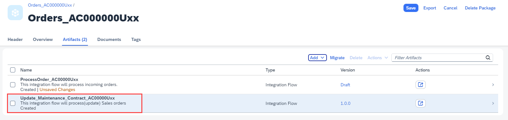
## Develop the integration flow
You can see that the Cloud Integration service has prebuilt parts of the integration flow, including Sender, Receiver, Start and End flow steps.

1. Click on the **Edit** button to start making changes to your integration flow.

    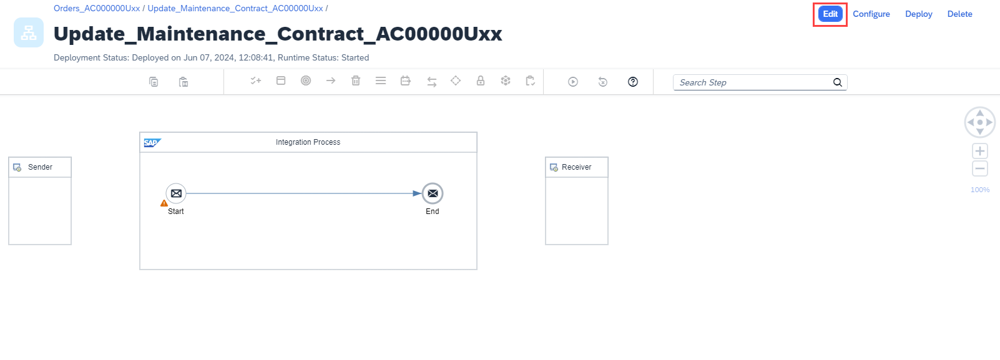

1. Click on the **Sender** box and rename it to **Event_Mesh**.

    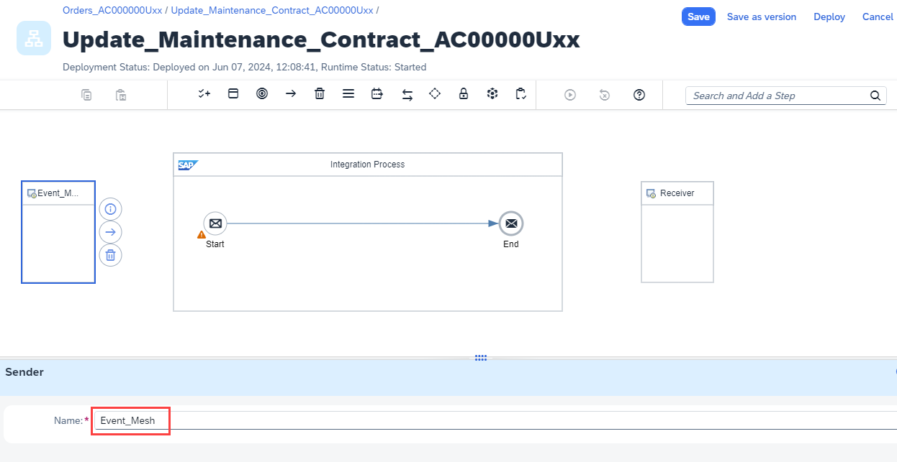
1. Click and drag the arrow symbol to the **Start** flow step.

    
1. In the pop-up for the Adapter Type, chose **AMQP**.

    
    * Choose **WebSocket** as **Transport Protocol**.
    * In the integration flow editor, you can now configure the adapter.

1. Define the **Connection Details** as follows:

    * **Host**: enterprise-messaging-messaging-gateway.cfapps.us10.hana.ondemand.com

    * **Port**: 443
 
    * **Path**: /protocols/amqp10ws
 
    * **Proxy Type**: Internet
 
    * **Connect with TLS**: checked
 
    * **Authentication**: OAuth2 Client Credentials
 
    * **Credential Name**: ems_ta

    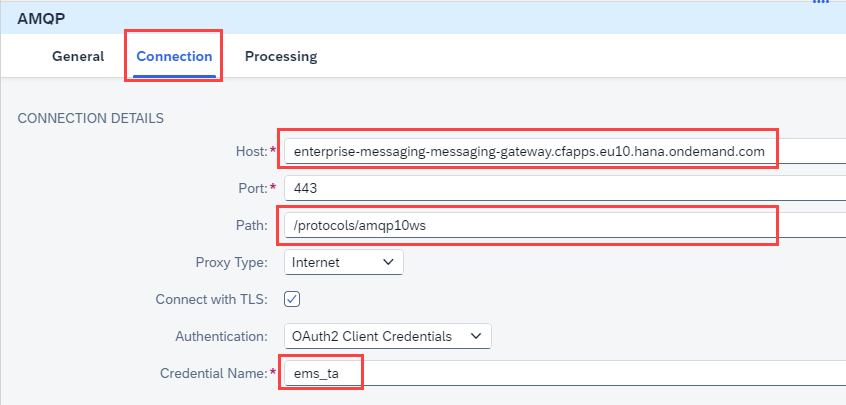
    
1. Define the **Processing** details as follows:

    * **Queue Name**: queue:sap/vr/A/AC233083U01
 
    * **Number of Concurrent Processes**: 1
 
    * **Max. Number of Prefetched Messages**: 5
 
    * **Consume Expired Messages**: checked
 
    * **Max. Number of Retries**: 0
 
    * **Delivery Status After Max. Retries**: REJECTED

    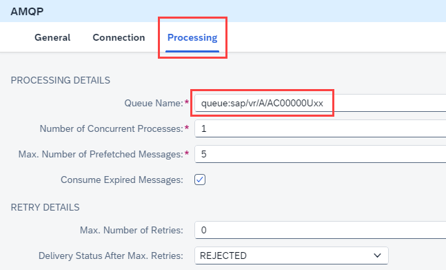

1. Select **Save** to persist your changes.

## Enhance integration flow to write to PostgreSQL
We will now proceed to create the request for updating the data into the database. To do so, we will create a SQL-statement using the incoming payload. This will include 2 steps: transforming the incoming JSON data structure into XML and building the SQL statement for the database.

1. In the top menu bar of the integration flow editor, select the **Message Transformers** item and select **Converter** item. Under Converter select the **JSON to XML converter** then drop the JSON to XML converter on the link between the **Start** and **End** flow steps (it highlights green).

    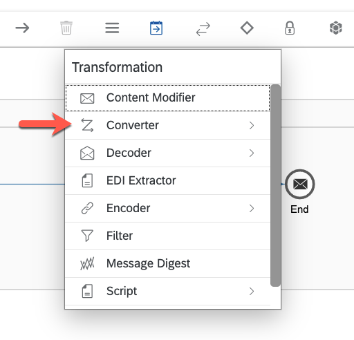
    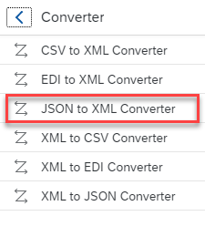
    Check that the converter step is placed on the link between Start and End by dragging it around for instance.

    Your integration flow should look like this:

    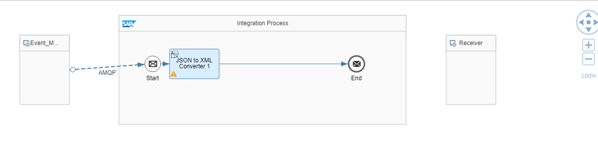

1. In the top menu bar of the integration flow editor, select the **Message Transformers** item and select the **Content Modifier**.

    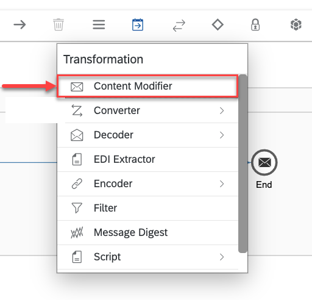

1. Drop the Content Modifier on the link between the **Converter** and **End** flow steps. Check that the content modifier step is placed on the link between Start and End by dragging it around for instance.

    * Rearrange your integration flow so that it stays clean and readable, using the handles of the various items, as well as dragging the items around.

    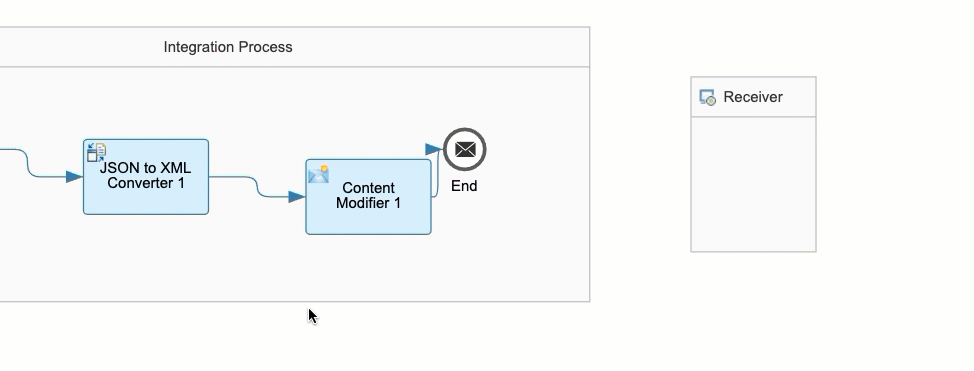
    * Your integration flow should look like this:

    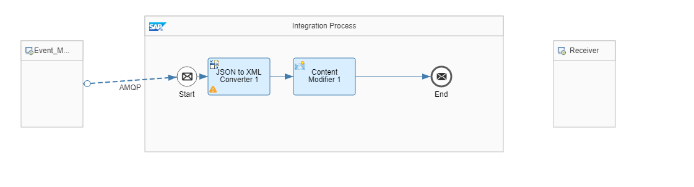

1. Click on **Save** in the editor before moving on to the next step.

    * The content modifier is a mighty flow step that lets you interact with the payload and metadata going through the integration flow.
    > **Note**: you can read the documentation of the flow steps by using the **question mark** symbol on the right of the configuration pane.

1. Click on the **Content Modifier** (if it is not active), open-up the configuration pane (if it’s hidden), click on **Exchange Property** and click on **Add**.

    * We will now read information out of the payload and store it for later use in the integration flow.
    * Remember that we have converted the incoming payload to XML so we can now use XPath expressions in the content modifier to read the payload elements. Once the payload elements are stored in exchange properties, we can reference them in any other part of our integration flow. In our example, we will build a dynamic SQL query.

1. Create the following Exchange Property.

    * OrderReference

        1. Action: Create
        1. Name: OrderReference
        1. Type: XPath
        1. Data Type: java.lang.String
        1. Source Value: //OrderReference

    * Quantity

        1. Action: Create
        1. Name: Quantity
        1. Type: XPath
        1. Data Type: java.lang.String
        1. Source Value: //Quantity

    This is what your content modifier should look like:

   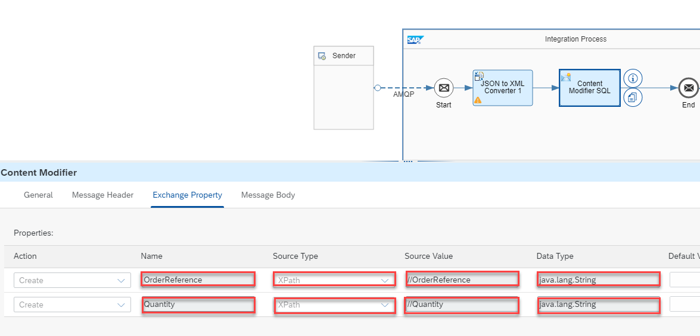

1. Click on **Message Body** in your content modifier.

    * The message body allows to alter the payload of the integration flow.
    * Set the **Type** to **Expression**
     
1. Enter the following text as body:

```
UPDATE technicalacademy.maintenance_contracts
SET quantity='${property.Quantity}'
WHERE order_reference ='${property.OrderReference}';
```
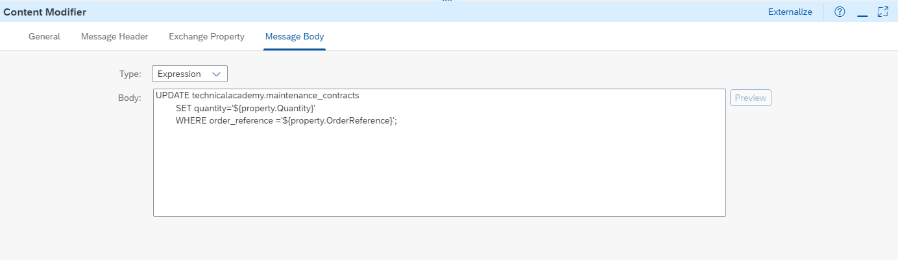
    * As you can see, we are dynamically creating the UPDATE statement.
    * Now that the payload is properly formatted, we need to send it to the PostgreSQL database.
    
9. Click on the **End** flow step and drag the arrow on top of the **Receiver** box.

    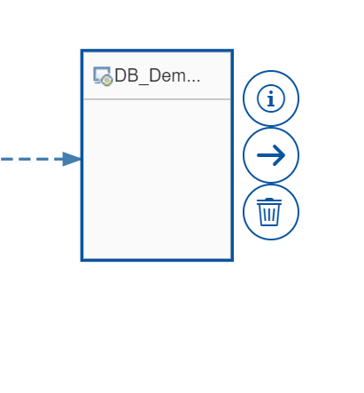

1. In the **Adapter Type** pop-up window, chose **JDBC**.

    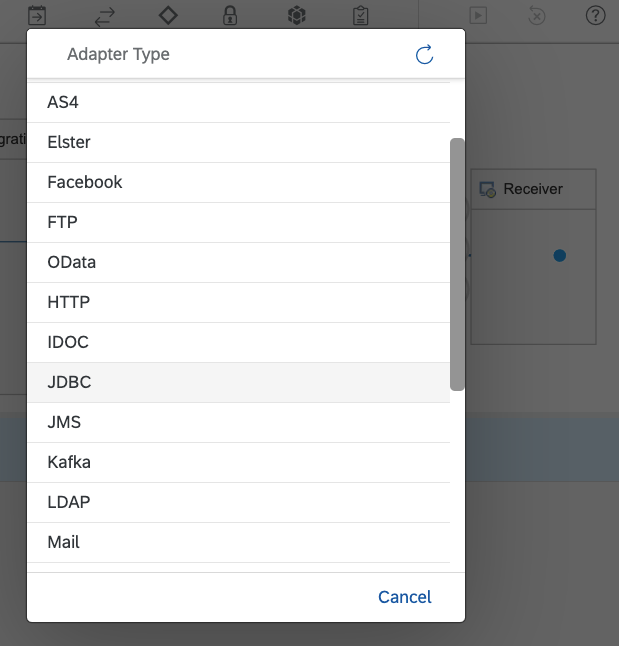

1. In the JDBC adapter configuration, click on **Connection** and fill-in the configuration as follows:

    * JDBC Data Source Alias: **AC_PostgreSQL_Cloud**

    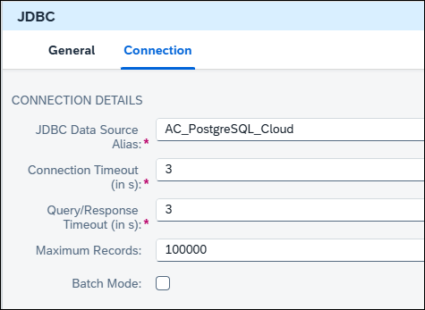
1. Save your integration flow.
1. Deploy your integration flow
## Import Iflow
> **Note**: In case you did not have time to go through all steps, you can also import the integration flow from the Files folder.

 1. Navigate to your Integration Package **Orders_AC233083U01**.

1. Click on **Edit**

1. Click on **Add** and select **Integration Flow** >

    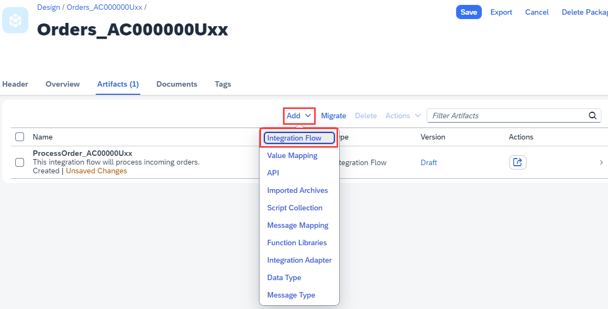
1. Click on **Upload**, then select the file through the **Browse** button, and **rename** your integration flow to **Update_Maintenance_Contract_AC233083U01**. In case you already have an integration flow with the same name, rename the integration flow with something like **Update_Maintenance_Contract_AC233083U01_2**.

    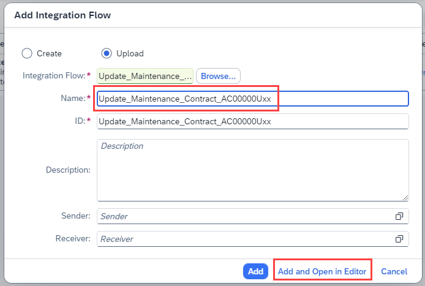
1. Open the integration flow

1. Define the **Connection Details** as follows:

    * **Host**: (enterprise-messaging-messaging-gateway.cfapps.us10.hana.ondemand.com)
    * **Port**: 443
    * **Path**: /protocols/amqp10ws
    * **Proxy Type**: Internet
    * **Connect with TLS**: checked
    * **Authentication**: OAuth2 Client Credentials
    * **Credential Name**: ems_ta
    

1. Define the **Processing Details**: as follows:

    * **Queue Name**: queue:sap/vr/A/AC233083U01
    * **Number of Concurrent Processes**: 1
    * **Max. Number of Prefetched Messages**: 5
    * **Consume Expired Messages**: checked
    * **Max. Number of Retries**: 0
    * **Delivery Status After Max. Retries**: REJECTED
    
1. Save and Deploy.

## Testing
We will test our created queue by changing the order quantity which was created in previous exercises (Chapter 3 exercise 3). Queue will listen to changes made to your sales order details.

1. Click on: S/4 HANA to open the SAP Fiori Launch Pad

1. Login to System using

    * Your Login user: AC233083U01 and
 
    * Your password, provided via mail or by your instructor

    
1. Select tile **Change Sales Order** (VA02)

    

1. Enter the **Sales Order** number which you got in the Process Integration exercise (Unit 3, Lesson 3) using the Postman tool and select **Continue**.

    

1. Match your order refrence number and change the **quantity** and then do **save**.


1. Check the quantity update in **PostgreSQL Maintenance Contract Database** using UI exposing its data. UI_Link. Filter by your **Order Reference** Number.

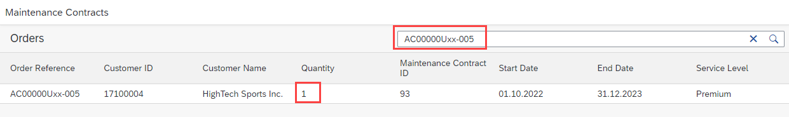
> **Note** : Please try to reopen the link if you can’t get the new record with an updated quantity.

<br>

**Congratulations!**
You have successfully finished this hands-on workshop!