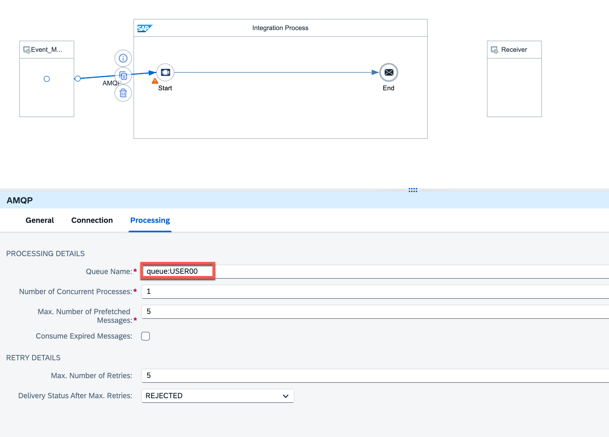

# Overview


> **Objectives**
> 
> After completing this lesson, you will be able to:
> 
> familiarize yourself with the concepts of eventing.


# SAP Integration Suite - Eventing
## Script Overview
### Highlights
In this section, you will familiarize yourself with the concepts of eventing.

Events allow us to react to changes, by informing that something has changed.

In our scenario we will use event mesh to synchronise the quantity from Sales Orders and Maintenance Contracts.

During the course of this exercise, you will create a queue that will receive changed order events. Next, you will build an iflow to consume the changed order data and update the maintenance contract database.

### Prerequisites
* Your Session-User, provided via mail or by your instructor
* Access to the landing page of your Session-Account via link, provided via mail or by your instructor
### Goal
The goal of this section is to configure Event Mesh and SAP Cloud Integration to react on the changed quantity of a sales order in S/4HANA and update the related Maintenance Contracts database.

### Further information
[SAP BTP Event Mesh documentation](https://help.sap.com/viewer/bf82e6b26456494cbdd197057c09979f/Cloud/en-US/df532e8735eb4322b00bfc7e42f84e8d.html)
### Exercise map
In the following chapters of this exercise you will use SAP Event Mesh.


# Introduction to Eventing


> **Objectives**
> 
> After completing this lesson, you will be able to:
> 
> configure the SAP Event Mesh service to handle a Cloud event.

# Eventing – Event Mesh Queue
In this chapter, we will try to listen to the events created in the **S/4 HANA** On-Premise system, when we change an already created sales order.


## Backend Setup
There is no need for the participants to do the backend setup as it is a one time activity that we already done in the setup.

Please find the details on the configuration in the following video.

**Please find the reference blogs that we used for the setup**

[Configure SAP Event Mesh for SAP S4HANA on premise via service key](https://blogs.sap.com/2021/02/15/configure-sap-enterprise-messaging-for-sap-s-4-hana-on-premise-2020-via-service-key/)

[Publishing events from S4HANA to Event Mesh for Cloud Integration for external systems](https://blogs.sap.com/2021/10/28/publishing-events-from-s-4-hana-to-event-mesh-for-cloud-integration-for-external-systems/)

[Enable SAP Cloud Integration to consume messages from Event Mesh](https://blogs.sap.com/2022/06/14/blog-post-enable-sap-cloud-integration-suite-to-consume-messages-from-sap-event-mesh-service/)

## Access the Event Mesh
1. Follow link for the [SAP Event Mesh](https://csd.integrationsuite.cpi.cn20.apps.platform.sapcloud.cn/shell/configureeventmesh/overview) service
## Configure Event Mesh Queue
1. Go to **Configure -> Event Mesh**

1. Select Message client named **emis**

   

1. Click **Queues => Create Queue**


1. In Queue Name: **USERXX** and select **Create** button to create queue.


## Subscribe to a Topic in Event Mesh
1. Click on the queue and select **Subscriptions**

    Click **Create**

   

1. Enter Topic : **csm/sap/events/***

  

   Click **Create**.


## Design the iFlow to consume the event


1. Make sure that you are in **Edit** mode (**Save** is displayed instead of **Edit**) of the package and click on **Add** and select **Integration flow**.


1. Fill in the fields as follows:

    * **Name**: **Log Sales Order Change Event XXX**

    * **ID** will be auto-filled with **Log_Sales_Order_Change_Event_XXX**

    * **Description**: “This integration flow will process(update) Sales orders”

    * The fields **Sender** and **Receiver** are not relevant for now.

    * Click on **Add**

   

1. Your integration flow has correctly been created, and you can now access it by clicking on the row containing the artifact.


## Develop the integration flow
You can see that the Cloud Integration service has prebuilt parts of the integration flow, including Sender, Receiver, Start and End flow steps.

1. Click on the **Edit** button to start making changes to your integration flow.

    

1. Click on the **Sender** box and rename it to **Event_Mesh**.

    
1. Click and drag the arrow symbol to the **Start** flow step.

    
1. In the pop-up for the Adapter Type, chose **AMQP**.

    
    * Choose **WebSocket** as **Transport Protocol**.
    * In the integration flow editor, you can now configure the adapter.

1. Define the **Connection Details** as follows:

    * **Host**: csd-efed7906-35ce-45e3-8601-b5ec6a44f423.cn20.a.eventmesh.integration.platform.sapcloud.cn

    * **Port**: 443
 
    * **Path**: /protocols/amqp10ws
 
    * **Proxy Type**: Internet
 
    * **Connect with TLS**: checked
 
    * **Authentication**: OAuth2 Client Credentials
 
    * **Credential Name**: EMIS_OAUTH

   
    
1. Define the **Processing** details as follows:

    * **Queue Name**: queue:USERXX
 
    * **Number of Concurrent Processes**: 1
 
    * **Max. Number of Prefetched Messages**: 5
 
    * **Consume Expired Messages**: checked
 
    * **Max. Number of Retries**: 0
 
    * **Delivery Status After Max. Retries**: REJECTED

   
   
1. Drag the Groovy script 

   

1. Paste the following code to log the event data

    ```
    import com.sap.gateway.ip.core.customdev.util.Message;
    import java.util.HashMap;
    def Message processData(Message message) {
    def body = message.getBody(java.lang.String) as String;
    def messageLog = messageLogFactory.getMessageLog(message);
    if(messageLog != null){
    messageLog.addAttachmentAsString("Log Current Payload:", body, "text/plain");
    }
    return message;
    }
    ```
   Click **Apply** 

   > **Note**: Please ignore the alarm message

    
   
  

1. Delete the Receiver and select **Save** to persist your changes.

    

1. Deploy your integration flow

    

1. Confirm the popups to deploy the artifact

    

1. Go to Monitor page and check the deployment status

    


## Testing
We will use Postman to change the Sales Order via OData and S/4HANA will generate chagne event. The event will trigger the iFlow to log the event data.

> **Note**: We will use Postman to do Sales Order change with OData.
> Please download the [Test Collection](https://robin-qiu.github.io/Integration-Suite-with-Event-Mesh/vx_attachments/542514425279645/GC%20CSM%20Customer%20Success%20Day.postman_collection.json)

1. Use your user ID to fetch the boundled Sales Order

```
<UserName>USERXX</UserName>
```


1. Change the values for **SalesOrder** and **IncotermsLocation1** and POST it. 


```
<root>
    <SalesOrder>640178</SalesOrder>
    <IncotermsLocation1>Shanghai</IncotermsLocation1>
</root>
```


1. Go to message monitoring page and check the attachment log payload


1. In the log, you should find the Sales Order you've changed.


<br>

**Congratulations!**
You have successfully finished this hands-on workshop!