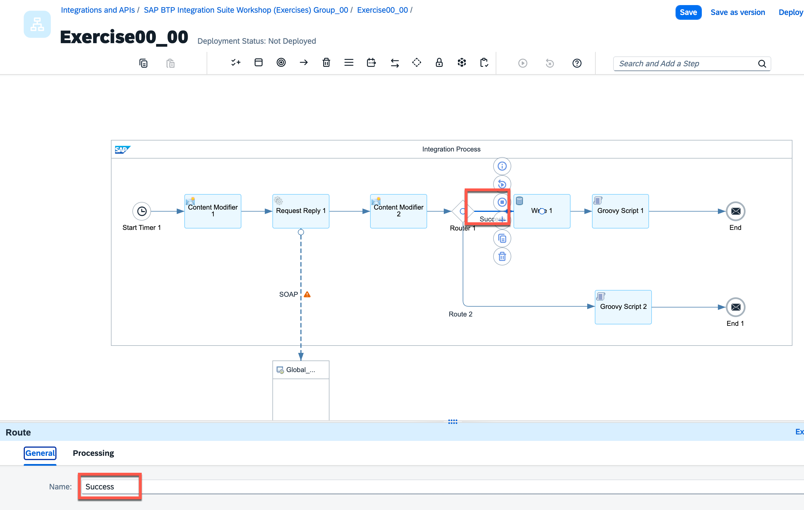

# <font color=#ee9955 size=8 face="黑体"> Exercise 00 - Smoke Test Monitoring via WebUI</font>

## Prerequisites  
 - **SAP BTP Account:** You should have created the BTP account and set up the Integration Suite tenant.


---

## Details

##### Follow these steps for integration flow creation in Web UI.
1 . Familiarize yourself with the environment and choose the **“Design”** area. Here, you will create an Integration Package to store your iFlows for different Exercises
In the left-hand navigation, you can switch between the following sections of the Web application:
-	**Discover** → SAP’s Reference Catalog
-	**Design** → Your customer Workspace (Design Time Content)
-	**Monitor** → Message Monitoring and deployed integration flows


2. Click on **Create** on the right most corner
Enter Details 

    * a)	**Name**: SAP BTP Integration Suite Workshop (Exercises) Group_XX
        
         > **NOTE**: Replace XX with the group number provided by the instructor
 
    * b)	**Short Description**: SAP BTP Adoption Lab, Integration Suite
 
    * c)	**Version**: 1.0.0
 
    * d)	**Vendor**: A&C


3. Click on **Save**


4. Navigate to **ARTIFACTS** Tab


5. Click on **Add-> Integration Flow**


6. Select **Create** and enter following details:

    * a.	Name: **Exercise00_XX**
 
    * b.	Description:  **Exercise00_SAP Cloud Integration_Smoke_Test_Monitoring_via_WebUI**
 
    * c.	Click on **Add**

> **Note**: Please remember to save after every action


7. 	Click on Exercise00_XX


##### Define and edit integration flow
1. 	Click on **EDIT** button on the lower corner on top right corner side.


2.	Click on Sender and select **Delete**


Similarly, click on Start Message, select **Delete**


3. 	Integration Flow should appear like this


4.	Now, let's model the integration flow

    Select **Timer** from Palette
    **Events -> Timer**

    Place it in the integration flow by clicking inside the integration process


5.	Select **Timer** and maintain schedule. 

    Choose **Basic** and use the default setting

    > (This would ensure that iFlow is executed as soon as it is deployed)


6. Connect **Timer to End Message** event


6. 	From the palette, select **Message Transformers -> Content Modifier** and drop it on the connection between **Timer** and **End messag**e in the Integration flow. This would automatically create the connections. Place it in the integration flow by clicking inside the integration process

7. Switch to **Message Body** tab, paste the content given below:
    ```xml
    <ndf:NDFDgenByDay xmlns:ndf="https://graphical.weather.gov/xml/DWMLgen/wsdl/ndfdXML.wsdl">
                <latitude>35.4</latitude>
                <longitude>-97.6</longitude>
                <startDate>2025-10-15</startDate>
                <numDays>1</numDays>
                <Unit>m</Unit>
                <XMLformat >DWML</XMLformat>
                <format>24 hourly</format>
    </ndf:NDFDgenByDay>
    ```
    Click **Save**
    > **Note**: This latitude and longitude is of **Oklahoma City**.


8.  From the palette, select **Call -> External Call -> Request Reply** and drop it on the connection between **Content Modifier** and **End message** in the Integration flow.


9. Click on **Request Reply** step, select **Connector** and drag it to **Receiver** system. (You might drag Receiver under Request-Reply for better readability)
This would open the receiver adapter list.
Select **SOAP** adapter

    Select **SOAP 1.x** as Message Protocol


10. Switch to **Connection** Tab, enter the following details:
    * a. Address: **https://graphical.weather.gov/xml/SOAP_server/ndfdXMLserver.php**
    * b. Select Authentication as **“None”**
    Keep all other parameters as it is.


    

    Click **Save**
    > **Note**: In case, this service is not available we need to change the service endpoint to mocked weather service which is deployed on the Integration Suite tenant for you. Also, you need to change the Authentication to Basic
    Instructor will provide you the SOAP Endpoint of mocked weather service.


11.  Click on Receiver system and set Name as **Global_Weather**


12. From the palette, select **Message Transformers -> Content Modifier **and drop it on the connection between **Request Reply** and **End** message in the integration flow.


Switch to **Exchange Property** tab, click on **Add** and add following properties:

* Action: **Create**
* Name: **responseResult**
* Type: **XPath**
* Data Type: **java.lang.String**
* Value: **//\* [local-name()='XMLByDayOut']/text()**

Click **Save**


13. Select **Router** from the palette, drag and drop it on the connection between **Content Modifier** and **End** message


14. From the palette, select **Persistence > Data Store Operations > Write** and drop it on the connection between **Router** and **End** message in the integration flow.


Provide the following properties:
* a. Data Store Name:
**WeatherData_XX**
* b. Entry ID: **Oklahoma City**
* c. Overwrite Existing Message: **Checked**
> **Note**: Replace XX with your Group ID
Save and ignore all the errors.


15. From the palette, select **Script > Groovy Script** and drop it on the connection between **Write** data store flow step and **End** message in the integration flow.


Click on **Create** icon


Replace the script default code with the following code:
```java
import com.sap.gateway.ip.core.customdev.util.Message;
import java.util.HashMap;
def Message processData(Message message) {
def body = message.getBody(java.lang.String) as String;
def messageLog = messageLogFactory.getMessageLog(message);
if(messageLog != null){
messageLog.addAttachmentAsString("Log Current Payload:", body, "text/plain");
}
return message;
}
```

Click on **Apply**
> Note: Please click **Close** to ignore the warning message.


16. From the palette, add another **Groovy Script**
Place it as shown in the integration flow

Click on **Create** icon


Replace the script default code with the following code:
```java
import com.sap.gateway.ip.core.customdev.util.Message;
import java.util.HashMap;
def Message processData(Message message) {
def messageLog = messageLogFactory.getMessageLog(message);
if(messageLog != null){
messageLog.addAttachmentAsString("Log Current Payload:", "No valid response found from the webservice", "text/plain");
}
return message;
}
```

Click on **Apply**
> Note: Please click **Close** to ignore the warning message.


17. From the palette, Choose **End Message** and place it after the second Groovy Script.


18. Connect **Router** to the **Groovy Script**

19. Connect **Groovy Script** to the **End 1** Message


20. Select connection between **Router** and **Write** step and configure the route with following values:
* a. Name: **Success**
* b. Expression Type: **Non-XML**
* c. Condition: **${property.responseResult} != ''**




21. Select connection between **Router** and **Groovy Script** step and configure the route with following values:
* a. Name: **No Response**
* b. Default Route: **Checked**


22. **Save** your changes


##### Deploy Integration Project on tenant
1. Press **Deploy** in the Integration Flow Task Bar.


2. You will receive a confirmation. Click on **Yes**.
Once the deployment is completed successfully you will receive a 2^nd^ notification.


3. Verify if the deployment is successful:
In the first level Menu Bar switch to Section **Monitor** and then click on **All** in **Integration and APIs**.


1. You should see the message status and log payload

    

   


1. Navigate back to the to the **Monitor** page and check the data store

    

1. There should be one weather record stored 


<br>

**Congratulations!**
You have successfully finished this hands-on workshop!