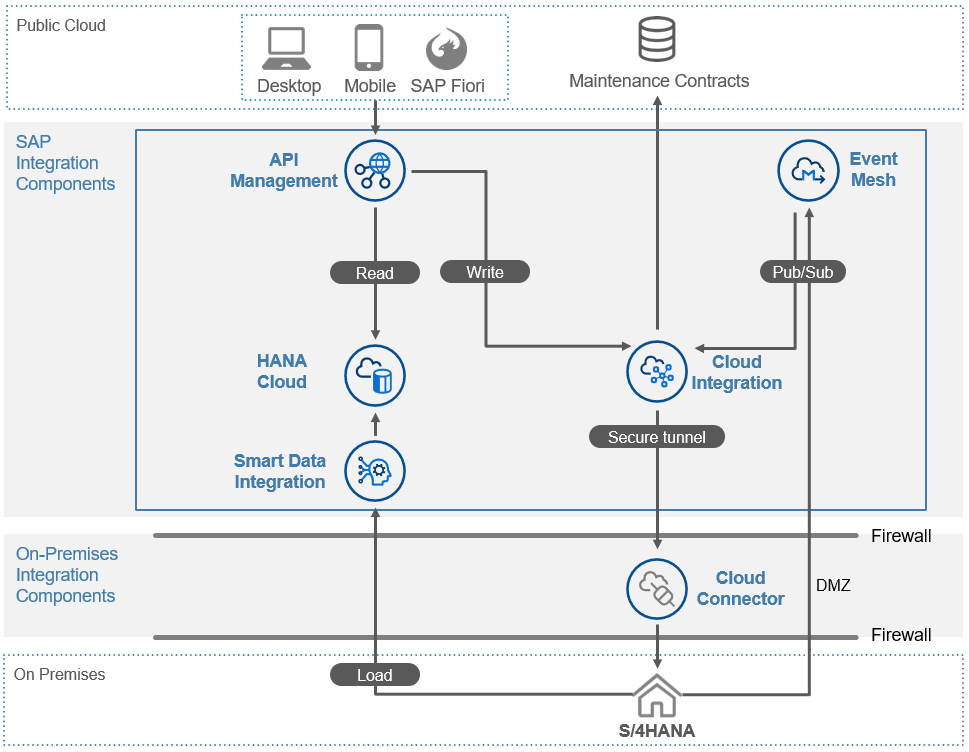

<h1 style="text-align: center;color:blue;font-weight:bold;">「SAP 用户成功日」—— SAP BTP [业务技术云平台] 专场 #</h1>
<h3 style="text-align: center;"> 借助 SAP BTP CAP 加速 Clean Core 扩展开发 </h3>

---

# Overview
# Introduction to SAP Integration Suite Services

## Overview
IT-Landscapes become more distributed, more heterogenous, more complex. New business requirements are emerging, the expectations of end users change and the velocity of change increases: hence a need for more agile, decoupled and mediated architectures as basis for these requirements has emerged. A modern Integration layer becomes a fundemantal discipline for implementing these new requirements.

Through architectural patterns, methodologies, and technologies. The Digital Integration Hub is a pattern that allows to reduce friction between modern and legacy systems, in terms of technology and throughput. The SAP Integration Solution Advisory Methodology allows to establish Integration as enterprise-wide, re-usable and streamlined descipline. The SAP Integration Suite is a collection of services for the implementation of a decoupling layer, allowing the implementation of all integration styles, based on typical EAI patterns.

At the end of this Technical Academy, you will have implemented a Digital Integration Hub based on the SAP Business Technology Platform.

## Exercises
> Note: Make sure to follow the exercise documentation and use the provided naming conventions. Otherwise, you will encounter issues.

### Story
Your company wants to become more digital in order to be able to sell premium products in new ways: you want to serve the customer at home and provide resellers with modern ways to engage with them.

However, your company is always struggling when it comes to implement new requirements such as integrating applications or developing apps or web portals for their customers and employees. Indeed, some systems do not scale as required nor do they provide the right interfaces for the new requirements.

New market contenders make the life of your company difficult: they are much efficient in taking care of their customers resulting in lower costs, higher sales and happier customers.

Through an agile, micro-oriented architecture integration layer, close to the customer and employee, your company wants to decouple the backend systems from modern applications, allowing for more agility in application development, frictionless operations as well as frictionless upgrades in the backends.

During this Technical Academy, you will implement several integration use cases that will enable your company to establish the SAP BTP as Digital Integration Hub

### Prerequisites
* Access to the Landing Page of your Session-Account via link, provided via mail or by your instructor
* Your username and password, provided via mail or by your instructor
* You have **Postman** or you have another tool that let’s you easily test web services such as REST APIs.

### Further information
* [SAP Integration Solution Advisory Methodology](https://help.sap.com/docs/integration-suite/sap-integration-suite/sap-integration-solution-advisory-methodology)
* [SAP Integration Suite](https://www.sap.com/products/technology-platform/integration-suite.html)
* [SAP Learning Journey - Developing with SAP Integration Suite](https://learning.sap.com/learning-journey/developing-with-sap-integration-suite)
* [Digital Integration Hub - Overview (LinkedIn)](https://www.linkedin.com/pulse/digital-integration-hub-turbocharges-your-api-strategy-pezzini/)